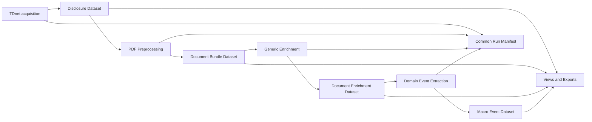

# TDnetパイプライン出力シンプル化設計

## 関連リンク

- [プロジェクトキックオフプロンプト](pipeline_output_simplification_kickoff_prompt.md)
- [汎用本文メタデータ・エンリッチメント設計](generic_body_metadata_enrichment_design.md)
- [半導体マクロイベント抽出設計](semiconductor_macro_event_extraction_design.md)
- [既存スキーマ索引](schema/README.md)
- 上流実装: `020_prop_candidates/notebook/fetch_tdnet_metadata.py`
- タイトル分類実装: `020_prop_candidates/notebook/classify_real_estate_titles.py`
- PDF前処理実装: `020_prop_candidates/notebook/tdnet_pdf_preprocessing.py`
- 汎用本文エンリッチメント実装: `notebook/generic_body_metadata_enrichment.py`

## 目次

1. [背景と目的](#1-背景と目的)
2. [現状の課題](#2-現状の課題)
3. [設計原則](#3-設計原則)
4. [目標アーキテクチャ](#4-目標アーキテクチャ)
5. [工程別の目標出力](#5-工程別の目標出力)
6. [共通run manifest](#6-共通run-manifest)
7. [互換性と移行方針](#7-互換性と移行方針)
8. [実施フェーズ](#8-実施フェーズ)
9. [受入基準](#9-受入基準)
10. [判断が必要な論点](#10-判断が必要な論点)

---

## 1. 背景と目的

現行TDnetパイプラインの処理工程は妥当である。

```text
TDnet metadata・PDF取得
  -> タイトル等のメタデータエンリッチメント
  -> PDF前処理
  -> 汎用本文メタデータエンリッチメント
  -> ドメイン別構造化データ抽出
```

一方、各工程が次の情報を別ファイルとして永続化している。

- canonicalな業務データ
- 同じpayloadのCSV・JSONL・Markdown projection
- 文書単位の診断情報
- 日次summary、failed、report
- 全期間を再結合した `*_all`
- debug、監査、legacy用途の中間成果物

このため、後段の入力契約が多数のファイルの存在、突合、Nullable、status、versionを扱う必要があり、処理ロジック以上にI/O契約が複雑になっている。

本プロジェクトの目的は、処理工程と監査可能性を維持したまま、永続化する正本を次の原則へ整理することである。

> 各工程は原則として1つのcanonical payloadと、全工程共通のrun manifestだけを永続化する。

CSV、Markdown、日次・全期間集計、failed一覧、review queueは、正本から再生成可能なviewまたはexportとして扱う。

---

## 2. 現状の課題

### 2.1 同じ情報の重複表現

PDF前処理では、1文書について次の成果物が生成される。

```text
raw.pdf
normalized.md
document_blocks.jsonl
document_tables.jsonl
candidate_evidence_spans.jsonl
evidence_package.json
processing_report.json
```

`normalized.md`、blocks、tables、evidence packageには同じ本文・メタデータの重複がある。`candidate_evidence_spans.jsonl` は不動産固有であり、汎用・半導体処理では使用しない。

### 2.2 日次版と全期間版の重複

各工程で日次成果物と `*_all` が生成されるが、全期間版は日次partitionの結合結果である。両方を正本として扱うと、再実行や部分更新時に不整合が発生し得る。

日次・全期間はファイル種別ではなく、partitioned datasetに対するquery scopeとして表現する。

### 2.3 運用情報の工程別再実装

各工程が個別に以下を持っている。

```text
summary.csv
failed.csv
daily_report.json
summary_all.csv
failed_all.csv
report_all.json
```

status、error、version、件数収支の意味が工程ごとに少しずつ異なるため、パイプライン全体の監視も複雑になる。

### 2.4 正本とprojectionの境界が不明確

詳細JSONを正本と定義しても、実運用では主CSV、summary、review queueも入力契約に含まれている。結果として、projectionを削除・再生成しにくい。

### 2.5 small filesの増加

リモートオブジェクトストレージ上で、文書数 × 工程数 × 成果物数のsmall filesが生成される。一覧取得、転送、整合性確認、ライフサイクル管理のコストが増える。

---

## 3. 設計原則

### 3.1 canonical・operational・projectionを分離する

| 区分 | 意味 | 永続化 |
|---|---|---|
| canonical | 後段処理の正本となる業務データ | 必須 |
| operational | stage status、error、version、処理時間 | 共通manifestへ必須 |
| projection | CSV、Markdown、review queue、日次集計 | 必要時に生成 |
| debug | prompt、raw response、一時chunk等 | 設定により期限付き |

### 3.2 1工程1canonical contract

後段は、1工程について複数ファイルの組合せではなく、1つのlogical artifactを入力とする。

物理的に複数partitionや複数Parquet fileへ分割されていても、論理契約は1 datasetとする。

### 3.3 日次と全期間を別成果物にしない

```text
dataset/disclosure_date=YYYY-MM-DD/part-*.parquet
```

日次処理は1 partition、全期間処理は複数partitionを読む。`*_all` は原則廃止する。

### 3.4 CSVは正本にしない

CSVはBI、レビュー、受渡しのためのexportとする。後段パイプラインはcanonical JSON/Parquetを読む。

### 3.5 evidence追跡は維持する

ファイル数を減らしても、次は削除しない。

- `document_id`
- `source_id`
- page number
- block/table ID
- evidence IDとquote
- schema、rules、taxonomy、extraction version
- model、prompt、token等のprovenance

### 3.6 remote storageを前提にする

logical URIと物理URIを分離する。ローカル絶対パスや、別工程のパス文字列置換に依存しない。

### 3.7 legacyとの互換期間を設ける

一括置換しない。新canonicalと旧成果物を一定期間dual-writeし、比較検証後に旧出力を停止する。

---

## 4. 目標アーキテクチャ



目標となる論理artifactは次の4つである。

1. `disclosures`
2. `document_bundles`
3. `document_enrichments`
4. `semiconductor_macro_events`

運用情報は全工程共通の `pipeline_run_documents` に集約する。

---

## 5. 工程別の目標出力

### 5.1 metadata・PDF取得

#### canonical

```text
disclosures/
  disclosure_date=YYYY-MM-DD/part-*.parquet

pdf/
  disclosure_date=YYYY-MM-DD/{document_id}.pdf
```

`disclosures`は次を含む。

- TDnet原メタデータ
- `document_id`, `source_id`
- PDF logical URI、hash、download status
- title enrichment結果
- enrichment method/version

#### 廃止・projection化

- 日次metadata CSV
- `tdnet_metadata_all_merged.csv`
- 分類済み日次CSV

タイトル分類は独立した論理stageとして維持できるが、物理出力は新しいcanonical dataset versionまたは追加columnsとして表現する。

不動産タイトル分類は半導体パイプラインの必須条件にせず、domain pluginとして扱う。

### 5.2 PDF前処理

#### MVP canonical

```text
document_bundles/
  disclosure_date=YYYY-MM-DD/
    {document_id}.document_bundle.json.gz
```

概念構造:

```json
{
  "schema_version": "1.0.0",
  "document_id": "20260722_6753_a1b2c3d4",
  "source": {
    "source_id": "tdnet-source-id",
    "pdf_uri": "artifact://pdf/20260722_6753_a1b2c3d4",
    "sha256": "..."
  },
  "preprocessing": {
    "status": "success",
    "quality": "high",
    "layout_type": "slide_like",
    "page_count": 20,
    "used_ocr": false,
    "warnings": []
  },
  "blocks": [],
  "tables": []
}
```

#### 原則廃止

- `candidate_evidence_spans.jsonl`
- `evidence_package.json`
- 文書ごとの独立した `processing_report.json`

#### on-demand projection

- `normalized.md`
- `document_blocks.jsonl`
- `document_tables.jsonl`

既存consumerとの互換期間中は、bundleから上記legacy filesを生成するadapterを用意する。

#### 将来のcompact形式

件数が増えた場合は、per-document JSON bundleを次のpartitioned Parquetへcompactできる。

```text
documents/
blocks/
tables/
```

この場合も論理artifact名は `document_bundles` のままとし、consumerへ物理配置を漏らさない。

### 5.3 汎用本文メタデータエンリッチメント

#### canonical

```text
document_enrichments/
  disclosure_date=YYYY-MM-DD/part-*.parquet
```

1行1文書とし、classification、routing、quality、完全なevidence、validationをnested columnsとして保持する。

#### projection化

- `generic_body_enriched_disclosure_metadata.csv`
- 文書ごとの `generic_body_metadata_enrichment.json`
- `enrichment_summary.csv`
- `enrichment_failed.csv`
- `daily_enrichment_report.json`
- すべての `*_all`

監査用の文書詳細JSONが必要な場合は、canonical rowからon-demand生成する。

### 5.4 半導体マクロイベント抽出

#### canonical

```text
semiconductor_macro_events/
  disclosure_date=YYYY-MM-DD/part-*.parquet
```

原則1行:

```text
1社 × 1開示 × 1マクロテーマ × 1事業影響
```

evidence refs、financial impacts、review情報、extraction provenanceをnested columnsで保持する。

イベント0件の文書状態は共通run manifestへ記録する。文書単位の詳細監査が必要な場合は、event datasetとmanifestからdocument extraction viewを生成する。

#### projection化

- 日次・全期間JSONL
- 日次・全期間CSV
- 文書ごとのcanonical JSON
- summary
- failed
- review queue
- daily/run report

review queueは次のviewとして生成できる。

```text
needs_human_review = true
```

---

## 6. 共通run manifest

### 6.1 目的

工程ごとのsummary、failed、reportを、共通の文書・stage実行履歴へ統合する。

### 6.2 推奨粒度

```text
1行 = 1 run × 1 document × 1 stage × 1 attempt
```

### 6.3 推奨フィールド

```text
run_id
document_id
source_id
stage
attempt
status
error_code
error_message
retryable
input_artifact_uri
output_artifact_uri
schema_version
logic_version
model
prompt_version
started_at_utc
finished_at_utc
duration_ms
input_count
output_count
warning_codes
metrics
```

### 6.4 status

共通statusは少数に限定する。

```text
success
no_output
skipped
needs_review
failed_validation
failed
```

工程固有の詳細は `error_code`, `warning_codes`, `metrics` で表現する。

### 6.5 生成可能なview

共通manifestから以下を生成する。

- 日次処理件数
- stage別成功率
- failed一覧
- retry対象一覧
- review対象文書
- schema/version分布
- latency、token、cost
- 件数収支

---

## 7. 互換性と移行方針

### 7.1 producerとconsumerを同時変更しない

各stageで次の順に移行する。

1. 新canonical schemaを定義
2. 現行出力から新canonicalを作るconverterを実装
3. fixtureで旧・新payloadの意味的同値性を検証
4. producerをdual-write
5. consumerを新canonicalへ切替
6. legacy projectionをadapter生成へ変更
7. 観測期間後にlegacy writeを停止

### 7.2 020と021の責務

- 020: TDnet取得、PDF保存、PDF前処理のproducer
- 021: 汎用本文エンリッチメント、半導体イベント抽出のconsumer/producer

本プロジェクトはcross-repositoryである。020の変更は、021側からimportして吸収するのではなく、020自身の専用branch/PRで実施する。

### 7.3 ロールバック

dual-write期間中はlegacy consumerへ戻せるようにする。新canonicalへ切替後も、一定期間はcanonicalからlegacy形式を再生成できる状態を維持する。

### 7.4 データ移行

過去データをすべて一度に再処理しない。

1. 代表日・代表文書でconverter検証
2. 直近期間をbackfill
3. consumer切替
4. 必要範囲だけ過去partitionをbackfill

---

## 8. 実施フェーズ

### Phase 0: inventory・意思決定

- 現行artifactのproducer/consumer一覧
- 各artifactの正本性、利用有無、保持要件
- remote storage、query engine、Parquet対応可否
- 互換期間と削除条件
- baselineの件数、容量、object数、処理時間

成果物:

- artifact inventory
- dependency graph
- ADR
- target contract draft

### Phase 1: 共通run manifest

- 共通schema
- 現行summary/failed/reportからのmapping
- manifest writer/reader
- 日次report view

共通manifestを先行することで、後続stageの出力削減後も可観測性を維持する。

### Phase 2: PDF document bundle

- bundle schema
- 現行7成果物からbundleへのconverter
- bundleからlegacy filesへのadapter
- 020 producerのdual-write
- 021 generic consumerのbundle対応

### Phase 3: generic enrichment dataset

- nested canonical schema
- detail JSON/主CSVとの同値性検証
- partitioned output
- summary/failed/reportのmanifest移管

### Phase 4: semiconductor event dataset

- event canonical dataset
- document statusのmanifest移管
- CSV/JSONL/review queue export
- 既存5設計成果物の契約改訂

### Phase 5: legacy停止・compact

- legacy consumerが0件であることを確認
- dual-write停止
- lifecycle policy適用
- small files compaction
- runbook更新

---

## 9. 受入基準

### 9.1 機能

- 現行と同じ対象文書・イベントを再現できる
- evidenceがpage/block/tableまで遡れる
- 0件、失敗、review、部分失敗を区別できる
- schema/version/provenanceを追跡できる

### 9.2 シンプルさ

- 各stageの必須入力artifactは原則1つ
- 各stageの必須永続出力はcanonical + common manifest
- 日次/allの重複正本がない
- CSV、Markdown、review queueは再生成可能
- legacy不動産evidenceが汎用契約に含まれない

### 9.3 データ品質

- 旧・新payloadの意味的差分が説明可能
- document/event件数が収支する
- ID、enum、Nullable、evidenceが同値
- dual-write比較で未解消のhigh severity差分がない

### 9.4 運用

- stage横断でstatus/errorを検索できる
- retry、backfill、部分再実行が可能
- remote storage上のobject数と容量が削減される
- legacyへロールバックできる

### 9.5 初期KPI案

- PDF前処理の文書当たり永続成果物: 約7ファイルから2 logical objects以下
- 各stageのsummary/failed/report: 共通manifestへ統合
- `*_all` の正本利用: 0件
- 後段consumerが要求するstage artifact数: 1
- evidence追跡可能率: 100%

---

## 10. 判断が必要な論点

実装開始前に次を決める。

1. MVP canonicalはper-document JSON bundleか、partitioned Parquetか
2. remote storageの種類とquery engine
3. common manifestの保存形式
4. debug artifactsの保持期間
5. CSV exportをいつ、どの利用者向けに生成するか
6. dual-write期間
7. 020・021のbranch/PR分割
8. 過去データのbackfill範囲

初期推奨は次のとおり。

- PDF前処理: `document_bundle.json.gz`
- 文書・イベントdataset: partitioned Parquet
- operational status:共通manifest Parquet
- CSV/Markdown: on-demand export
- legacy互換: adapter + 期間限定dual-write
