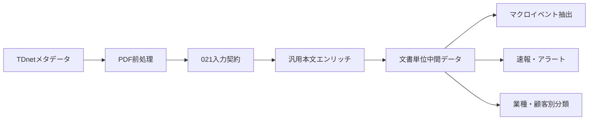

# 汎用本文メタデータ・エンリッチメント設計

## 関連リンク

- [入力スキーマ解説](schema/generic_body_metadata_enrichment_input_schema.md)
- [入力スキーマYAML正本](schema/generic_body_metadata_enrichment_input_schema.yaml)
- [出力スキーマ解説](schema/generic_body_metadata_enrichment_output_schema.md)
- [出力スキーマYAML正本](schema/generic_body_metadata_enrichment_output_schema.yaml)
- [スキーマ索引](schema/README.md)
- [同業マクロ影響イベントDB設計](peer_macro_event_db_design.md)
- [小売マクロイベントDB設計](ppih_retail_macro_event_db_design.md)

## 目次

1. [文書の位置づけ](#1-文書の位置づけ)
2. [背景と目的](#2-背景と目的)
3. [スコープ](#3-スコープ)
4. [リポジトリ境界](#4-リポジトリ境界)
5. [処理粒度と識別子](#5-処理粒度と識別子)
6. [入力契約](#6-入力契約)
7. [メタデータと前処理文書の突合](#7-メタデータと前処理文書の突合)
8. [テキストの利用範囲](#8-テキストの利用範囲)
9. [汎用分類体系](#9-汎用分類体系)
10. [ルールレジストリ](#10-ルールレジストリ)
11. [根拠選定](#11-根拠選定)
12. [スコアとconfidence](#12-スコアとconfidence)
13. [ルーティング](#13-ルーティング)
14. [出力成果物](#14-出力成果物)
15. [バージョニング](#15-バージョニング)
16. [バリデーション](#16-バリデーション)
17. [エラー処理](#17-エラー処理)
18. [可観測性](#18-可観測性)
19. [セキュリティ・ライセンス](#19-セキュリティライセンス)
20. [テスト設計](#20-テスト設計)
21. [実装順序](#21-実装順序)
22. [将来拡張](#22-将来拡張)
23. [レビュー観点](#23-レビュー観点)

---

## 1. 文書の位置づけ

本書は、TDnet適時開示の本文から、複数プロダクトで再利用できる文書単位の汎用メタデータを生成する工程を定義する。

- コンポーネント名: `generic_body_metadata_enrichment`
- 実装予定: `notebook/generic_body_metadata_enrichment.py`
- 入力スキーマ正本: `schema/generic_body_metadata_enrichment_input_schema.yaml`
- 出力スキーマ正本: `schema/generic_body_metadata_enrichment_output_schema.yaml`
- 本書の状態: `implemented`
- 設計版: `1.0.0`

YAMLを機械可読なデータ契約の正本とし、本書は目的、判定ロジック、運用上の判断を説明する。

---

## 2. 背景と目的

既存の `020_prop_candidates/notebook/body_based_metadata_enrichment.py` は、不動産取引候補の抽出に必要なキーワード、分類軸、ルーティングを持つ。不動産取引DBには適する一方、決算、業績予想修正、M&A、設備投資、減損、事業提携などを横断利用する中間データとしてはドメイン結合が強い。

本工程では、不動産固有分類を含まない「開示文書の汎用索引層」を021プロダクト側に構築する。主な利用先は以下である。

- 同業マクロ影響イベント抽出の入力選別
- 決算後速報、業績予想修正アラート
- M&A、業務提携、設備投資、減損のトラッキング
- セクター別・顧客別の後段エンリッチメント
- 人手レビューキューとデータ品質監視

本工程の価値は、高度なイベント抽出そのものではなく、後段が「どの文書を、どの根拠から、どの優先度で読むか」を一貫した契約で判断できることにある。

---

## 3. スコープ

### 3.1 対象

- TDnetの1開示文書を1レコードとする本文ベース分類
- 開示種別の推定
- 複数の主要トピックタグ
- 明示された事業イベント候補、財務影響候補
- 影響方向、実績・予想区分、時間軸、定量記載有無
- 判定根拠、信頼度、レビュー情報
- 後段の構造化抽出に対するルーティング
- 日次・実行単位の監視成果物

### 3.2 非対象

- 1文書から複数のマクロイベント行を生成する処理
- マクロテーマL1/L2の確定
- 顧客別 relevance、同業グループ、顧客事業へのマッピング
- 金額、企業、製品、地域、期間の完全な構造化抽出
- LLMによる分類・要約
- OCR、Vision、PDF解析そのもの
- EDINET、海外開示、月次売上資料などTDnet以外の取得

非対象の情報は、本文を再取得せずに本工程の詳細JSONと根拠を利用する下流工程で付与する。

---

## 4. リポジトリ境界

実装とスキーマは021リポジトリに置く。020のPythonモジュールをimportせず、020で生成済みの前処理成果物とはファイル契約で接続する。



初期段階では020互換の前処理成果物を入力ルートとして指定できるようにする。将来、取得・PDF前処理を021へ移管しても、入力スキーマを満たす限り本工程は変更しない。

---

## 5. 処理粒度と識別子

### 5.1 粒度

- 主出力: 1行 = 1開示文書
- 詳細JSON: 1ファイル = 1開示文書
- summary: 1行 = 1入力文書の処理結果
- failed: 1行 = 1失敗
- report: 1ファイル = 1日または1実行

### 5.2 識別子

- `document_id`: PDF前処理工程が発行した不変ID
- `source_id`: TDnet取得時の `disclosure_number` を優先し、なければ `document_url`
- `evidence_id`: 本工程が生成する根拠ID。`{document_id}_gev{order:03d}` を推奨

`document_id` は主キーであり、本工程で再採番しない。

---

## 6. 入力契約

詳細は入力スキーマを正本とする。

### 6.1 日次メタデータ

パス:

```text
data/original/tdnet_metadata_{yyyymmdd}.csv
```

必須列:

- `disclosure_date`
- `code`
- `company_name`
- `title`
- `document_url`

条件付き必須・推奨列:

- `disclosure_number`: 推奨。なければ `document_url` を `source_id` に使う
- `disclosure_time`
- `disclosure_datetime`
- `xbrl_url`
- `has_xbrl`
- `market`
- `update_history`
- `fetched_at_utc`

不動産タイトル分類済みCSVは入力に使用しない。

### 6.2 PDF前処理成果物

パス:

```text
data/processed/tdnet_pdf_preprocessed/{yyyymmdd}/documents/{document_id}/
```

処理に必須:

- `document_blocks.jsonl`
- `processing_report.json`
- `normalized.md` または `evidence_package.json` の少なくとも一方

任意:

- `document_tables.jsonl`
- `candidate_evidence_spans.jsonl`
- `raw.pdf`

既存 `candidate_evidence_spans.jsonl` は不動産キーワードで生成されるため、汎用分類の根拠として使用しない。汎用根拠は `document_blocks.jsonl` と `document_tables.jsonl` から再構成する。

### 6.3 入力品質

`processing_report.json` の `processing_status` と `document_text_extraction_quality` を取り込む。

- `processing_status == success`: 通常処理
- `processing_status == success_with_warnings`: 処理継続し、warningを出力へ引き継ぐ
- 上記以外のstatus: enrichment失敗
- `document_text_extraction_quality == low`: 分類は実行するが `needs_review`
- 本文ブロックが空: enrichment失敗
- 表ファイル欠損: 処理継続し、warningを記録

---

## 7. メタデータと前処理文書の突合

### 7.1 優先順位

1. 入力メタデータに `document_id` があり、前処理ディレクトリと一致
2. `source_id` / `disclosure_number` が前処理メタデータと一致
3. `disclosure_date + issuer_code + normalized_title` が一致

タイトル正規化はNFKC、大小文字統一、全角空白変換、連続空白圧縮、照合用記号除去を行う。原文タイトルは変更しない。

### 7.2 曖昧一致

候補が0件の場合は `preprocessed_document_not_found` とする。候補が複数件の場合、evidence件数などで推測選択せず `ambiguous_preprocessed_document` とする。

誤った文書のエンリッチは欠損より危険であるため、安全側に倒す。曖昧ケースはfailed成果物へ出し、入力側の不変キー追加で解消する。

---

## 8. テキストの利用範囲

分類対象テキストを以下の順に扱う。

1. 開示タイトル
2. `document_title`、`page_title`、`slide_title`、`section_heading`
3. `paragraph`、`bullet`、`note`
4. `document_tables.jsonl.markdown_table`

`header`、`footer` は既定で除外する。`quality_score` が閾値未満のブロックは根拠採用を抑制するが、文書全体の補助シグナルには利用できる。

原文 `text` は監査用に保持し、照合にはNFKC正規化した文字列を使用する。

---

## 9. 汎用分類体系

### 9.1 開示種別 `document_type`

1文書につきprimaryを1つ付与する。

| 値 | 意味 |
|---|---|
| `earnings_release` | 決算短信、四半期・通期決算 |
| `earnings_presentation` | 決算説明資料、補足資料 |
| `forecast_revision` | 業績・配当予想の修正 |
| `operating_update` | 月次売上、受注、KPIなどの定期更新 |
| `business_plan` | 中期経営計画、事業方針 |
| `dividend_shareholder_return` | 配当、自己株式取得・消却、株主還元 |
| `financing_capital_policy` | 増資、社債、借入、資本政策 |
| `ma_restructuring` | M&A、事業譲渡、会社分割、組織再編 |
| `business_alliance` | 業務・資本提携、共同開発 |
| `capex_fixed_assets` | 設備投資、工場新設、固定資産取得・譲渡 |
| `impairment` | 減損、事業損失、引当 |
| `legal_regulatory` | 訴訟、行政処分、法令・規制対応 |
| `governance_personnel` | 役員、人事、定款、ガバナンス |
| `sustainability` | 気候、環境、人権などサステナビリティ |
| `other` | 上記に該当しない、または判定不能 |

複数種別が一致する場合は、タイトル一致、見出し一致、本文一致のスコアでprimaryを決める。全候補とスコアは詳細JSONへ保存する。

### 9.2 主要トピック `topic_tags`

複数値を許容する。

```text
performance
outlook
demand_sales
pricing
costs
foreign_exchange
inventory
supply_chain
investment_capacity
portfolio_change
partnership
capital_structure
shareholder_return
asset_impairment
legal_compliance
governance_organization
sustainability
other
```

`topic_tags` は文書索引用の粗い横断軸であり、マクロテーマの確定値ではない。

### 9.3 事業イベント候補 `business_event_types`

本文に明示的なイベント表現がある場合に複数付与する。

```text
demand_change
price_change
cost_change
capacity_change
product_service_change
market_entry_exit
acquisition_disposal
partnership
restructuring
supply_disruption
workforce_change
other
```

イベント主体、対象事業、地域、製品は本工程では構造化しない。

### 9.4 財務影響候補 `financial_impact_types`

本文に明示的な財務項目がある場合に複数付与する。

```text
revenue
operating_profit
ordinary_profit
net_income
cash_flow
assets
liabilities
equity
capex
dividend
guidance
```

金額の抽出・単位変換・期間対応は下流へ委ねる。

### 9.5 補助分類

- `impact_direction`: `positive`, `negative`, `mixed`, `neutral`, `unclear`
- `actual_or_forecast`: `actual`, `forecast`, `both`, `unclear`, `not_applicable`
- `time_horizon`: `immediate`, `current_period`, `next_period`, `medium_term`, `multiple`, `unclear`, `not_applicable`
- `quantitative_data_present`: 金額、比率、数量等の明示的な数値表現の有無

方向は企業業績・事業への影響方向であり、株価評価ではない。肯定・否定語が混在する場合は `mixed`、根拠が弱い場合は `unclear` とする。

---

## 10. ルールレジストリ

分類規則はnotebook冒頭のレジストリに集約する。各ルールは以下を持つ。

```text
rule_id
target_field
target_value
title_keywords
heading_keywords
body_keywords
table_keywords
negative_keywords
priority
```

要件:

- キーワードは用途別定数へ散在させない
- 同一語の表記ゆれを正規化後に照合する
- 否定語、予定/実績、取消・撤回を別シグナルとして保持する
- ルールIDを詳細JSONの `matched_rule_ids` に残す
- enum追加・意味変更時はスキーマ版を更新する

---

## 11. 根拠選定

### 11.1 根拠の生成

ルールにヒットした見出し・本文ブロック・表を中心に、同一ページの前後ブロックを含むspanを生成する。

- 見出し: 見出し自身と直後2ブロック
- 本文: 前後1ブロック
- 表: 表と直前の見出しまたは本文
- 1spanの最大文字数: 2,000文字
- CSVの `evidence_ids`: confidence順で最大5件
- CSVの `evidence_preview`: 最上位根拠の先頭300文字以内
- 詳細JSON: 最大20件

### 11.2 根拠オブジェクト

```json
{
  "evidence_id": "20260501_6753_a1b2c3d4_gev001",
  "source_type": "block",
  "source_ids": ["..._p001_b003"],
  "page_numbers": [1],
  "matched_rule_ids": ["document_type.forecast_revision.001"],
  "keyword_hits": ["業績予想の修正"],
  "text": "原文...",
  "quality_score": 0.92
}
```

根拠本文は原文を保持する。CSVでは `evidence_ids` と、最上位根拠を先頭300文字以内へ切り詰めた単一の `evidence_preview` のみを格納する。完全な根拠オブジェクトは詳細JSONを正本とする。

---

## 12. スコアとconfidence

confidenceは統計的確率ではなく、ルール根拠の充足度を0.0〜1.0で表したヒューリスティック値である。

### 12.1 ソース重み

| シグナル | 重み |
|---|---:|
| タイトルの対象語一致 | 4 |
| 文書・節・スライド見出し一致 | 3 |
| 表の対象語一致 | 2 |
| 本文の対象語一致 | 1 |
| 独立した2件目以降の根拠 | 各1、最大2 |
| 高品質本文 | 1 |
| negative keywordとの競合 | -2 |
| 低品質本文 | -2 |

候補値ごとのraw scoreを比較し、最上位をprimaryとする。同点はルールpriorityで解消し、それでも同点なら `other` または `unclear` としてレビューへ送る。

### 12.2 confidence帯

| confidence | 解釈 |
|---|---|
| `0.80–1.00` | タイトルまたは見出しと本文根拠が整合 |
| `0.60–0.79` | 複数の本文根拠が整合、または強いタイトル根拠 |
| `0.40–0.59` | 単一・弱い根拠、競合あり |
| `0.00–0.39` | 判定不能または低品質 |

実装時にはraw scoreから帯への決定表を固定し、自己テストで境界値を検証する。

---

## 13. ルーティング

### 13.1 `downstream_priority`

| 値 | 条件概要 |
|---|---|
| `high` | 高価値種別、confidence 0.75以上、根拠あり、事業または財務影響候補あり |
| `medium` | 構造化抽出価値あり、confidence 0.55以上、根拠あり |
| `low` | 分類済みだが後段価値が低い、または弱い根拠 |
| `skip` | ガバナンス・人事等で影響候補なし、または判定不能 |

高価値種別は `earnings_release`, `earnings_presentation`, `forecast_revision`, `business_plan`, `ma_restructuring`, `business_alliance`, `capex_fixed_assets`, `impairment` を初期値とする。

### 13.2 `needs_structured_extraction`

以下をすべて満たす場合にtrueとする。

- `downstream_priority` が `high` または `medium`
- 根拠が1件以上
- `business_event_types` または `financial_impact_types` が1件以上
- 本文品質が `low` ではない
- validation errorがない

### 13.3 `candidate_stage`

```text
body_supported
body_weak
body_unclassified
needs_review
```

- `body_supported`: confidence 0.60以上かつ根拠あり
- `body_weak`: confidence 0.40〜0.59
- `body_unclassified`: confidence 0.40未満、分類不能
- `needs_review`: 入力低品質、競合、曖昧判定など人手確認が必要

---

## 14. 出力成果物

出力ルート:

```text
data/processed/tdnet_generic_body_metadata_enriched/
```

```text
{yyyymmdd}/
  documents/{document_id}/generic_body_metadata_enrichment.json
  generic_body_enriched_disclosure_metadata.csv
  enrichment_summary.csv
  enrichment_failed.csv
  daily_enrichment_report.json
generic_body_enriched_disclosure_metadata_all.csv
enrichment_summary_all.csv
enrichment_failed_all.csv
enrichment_report_all.json
```

主CSVは検索、結合、BI取込向けの薄いワイドテーブルとする。primary `document_type` はCSVにも保持するが、`document_type_candidates` の全候補とscore、ルールヒット、完全な根拠は詳細JSONだけに保持する。

詳細JSONを文書単位payloadの正本とし、CSV行は同じpayloadから決定的に生成するprojectionとする。CSVとJSONを別々の分類処理から構築してはならない。

---

## 15. バージョニング

二種類の版を全ての主出力と詳細JSONに持たせる。

- `schema_version`: 入出力構造と意味の版。Semantic Versioning
- `enrichment_version`: ルール、キーワード、閾値の実装版。`YYYY-MM-DD.NNN`

変更ルール:

- カラム削除、型変更、enumの意味変更: schema major
- nullableな追加列・追加成果物: schema minor
- 説明修正、制約に影響しない補足: schema patch
- キーワード、重み、閾値変更: enrichment version更新

過去スキーマは削除せず、重要な変更をMDへ記録する。

---

## 16. バリデーション

### 16.1 入力

- 日付形式と対象日フォルダの一致
- 必須列・必須ファイル
- `document_id` の文書内一貫性
- block/tableのページ番号と型
- quality scoreの範囲
- metadataと前処理メタデータの発行体・タイトル整合

### 16.2 出力

- enum、型、Nullable、confidence範囲
- `needs_structured_extraction=true` なら根拠あり
- `downstream_priority=high` ならconfidence 0.75以上
- `candidate_stage=body_supported` なら根拠あり
- `status=failed_validation` ならvalidation errorsあり
- `evidence_ids` と詳細JSONのevidenceが参照整合
- `evidence_preview` が詳細JSONの最上位根拠本文の先頭300文字と一致
- `schema_version` と `enrichment_version` が空でない

validation failureは主CSVに `failed_validation` として残し、同時にfailed成果物へ記録する。実行時例外は主CSVへ出さず、summary/failedへ記録する。

---

## 17. エラー処理

エラーカテゴリは機械判定可能なprefixを使う。

```text
missing_metadata_column
invalid_disclosure_date
preprocessed_document_not_found
ambiguous_preprocessed_document
missing_required_artifact
invalid_json
empty_document_blocks
preprocessing_failed
document_identity_mismatch
failed_validation
unexpected_error
```

1文書の失敗で日次処理全体を停止しない。設定・入力ルート・スキーマ自体が不正な場合は開始前にfail fastする。

---

## 18. 可観測性

日次・実行レポートには以下を含める。

- 入力件数、突合件数、処理件数
- success、needs_review、failed_validation、failed件数
- document type別件数
- priority別件数
- structured extraction対象件数
- text quality別件数
- エラーカテゴリ別件数
- schema/enrichment version
- 開始・終了時刻、処理時間
- 入出力パス

過去実行との分類分布差はルール回帰の検知に用いる。

---

## 19. セキュリティ・ライセンス

- 入力はTDnet等の公開開示を前提とする
- 商用データを本工程へ混在させない
- 原文URLと根拠を保持し、出所追跡を可能にする
- ログへ本文全文を出さない
- 失敗ログに認証情報・ローカル秘密情報を含めない

---

## 20. テスト設計

### 20.1 組み込みself-check

notebook内のpure functionに対して最低限以下を検証する。

1. 決算短信を `earnings_release`
2. 決算説明資料を `earnings_presentation`
3. 業績予想修正を `forecast_revision`
4. M&Aと財務影響の複数タグ
5. 工場新設を `capex_fixed_assets` + `capacity_change`
6. 減損をnegative + `assets/net_income`
7. 配当のみをlowまたはskip
8. ガバナンスのみをskip
9. 取消・撤回を単純なpositiveにしない
10. mixed direction
11. 低品質本文をneeds_review
12. 根拠なしでstructured extractionをtrueにしない
13. 同点分類をneeds_review
14. JSON配列のCSV直列化
15. validation errorのfailed記録

### 20.2 スモークテスト

- 1日、最大10文書で実行
- 文書詳細JSONとCSVの参照整合
- 入力件数とsummary/failed件数の収支
- enum、型、Nullableのスキーマ適合
- 既存020成果物を読み取り専用で利用できること
- 020側へファイルを書き込まないこと

---

## 21. 実装順序

### フェーズ1: 設計レビュー

1. 本設計書
2. 入力スキーマYAML/MD
3. 出力スキーマYAML/MD
4. スキーマ索引
5. レビューと承認

### フェーズ2: 承認後

1. notebook実装
2. validatorとself-check
3. fixture検証
4. 少量実データのスモークテスト
5. 分類分布と誤判定レビュー

本書とスキーマが承認されるまでフェーズ2へ進まない。

---

## 22. 将来拡張

- ルールレジストリの外部YAML化
- LLM補完を別methodとして追加
- マクロイベント単位への展開
- 業種別taxonomy plugin
- 顧客別 relevance plugin
- EDINET・海外開示へのsource adapter
- DB/Parquet出力

汎用文書層の既存フィールドを用途固有enumで拡張せず、詳細イベントは別スキーマとして追加する。

---

## 23. レビュー観点

1. 文書単位中間層とイベント抽出層の責務分離は適切か
2. `document_type` とtopic enumは初期プロダクト用途を過不足なく覆うか
3. 入力必須ファイルの範囲は妥当か
4. 曖昧突合を失敗扱いにする安全性優先方針は妥当か
5. confidenceとルーティング閾値は妥当か
6. CSVと詳細JSONの情報分担は妥当か
7. `needs_structured_extraction` の条件は後段用途に十分か
8. versioningとvalidation failureの扱いは運用可能か
