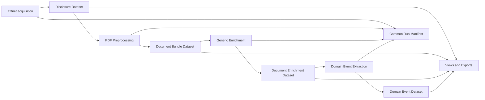

# TDnetパイプライン出力シンプル化設計

## 関連リンク

- [キックオフプロンプト](../99_prompt/pipeline_output_simplification_kickoff_prompt.md)（未作成。本設計レビュー後に作成する）
- [旧版（2026-07-23時点でarchive、本書が更新・復元した版）](archive/pipeline_output_simplification_design.md)
- [TDnet PDF前処理 出力シンプル化設計（検証フェーズ）](tdnet_pdf_preprocessing_output_simplification_design.md)
- [汎用本文メタデータ・エンリッチメント設計](generic_body_metadata_enrichment_design.md)
- [半導体マクロイベント抽出設計](semiconductor_macro_event_extraction_design.md)
- [既存スキーマ索引](schema/README.md)
- 上流実装: `020_prop_candidates/notebook/fetch_tdnet_metadata.py`（021へ移植版: `notebook/fetch_tdnet_metadata.py`）
- タイトル分類実装（本書で汎用化対象）: `notebook/classify_real_estate_titles.py`
- PDF前処理実装: `notebook/tdnet_pdf_preprocessing.py`
- 汎用本文エンリッチメント実装: `notebook/generic_body_metadata_enrichment.py`

## 改訂メモ

本書は `archive/pipeline_output_simplification_design.md`（初版）をレビューした上での更新版である。初版の課題認識・設計原則・目標アーキテクチャは妥当と判断し、そのまま踏襲する。本版での主な追加・変更は次の2点。

1. 実施フェーズに優先順位を明示し、着手前の工程（半導体マクロイベント抽出）から先に直すという方針を追加した（8章）。
2. `classify_real_estate_titles.py` の汎用化を新規スコープとして追加した（6章）。この工程は不動産取引抽出パイプライン時代の名残であり、汎用パイプラインの前提と矛盾している。

初版がリンクしていた本ファイルパス（`docs/02_data_pipeline/pipeline_output_simplification_design.md`）は、他の設計書（`tdnet_pdf_preprocessing_output_simplification_design.md`、`semiconductor_macro_event_extraction_design.md`）から相対リンクで参照され続けていたため、本書をこのパスへ復元した。

---

## 目次

1. [背景と目的](#1-背景と目的)
2. [現状の課題](#2-現状の課題)
3. [設計原則](#3-設計原則)
4. [目標アーキテクチャ](#4-目標アーキテクチャ)
5. [工程別の目標出力](#5-工程別の目標出力)
6. [classify_real_estate_titlesの汎用化](#6-classify_real_estate_titlesの汎用化)
7. [共通run manifest](#7-共通run-manifest)
8. [実施フェーズ](#8-実施フェーズ)
9. [互換性と移行方針](#9-互換性と移行方針)
10. [受入基準](#10-受入基準)
11. [判断が必要な論点](#11-判断が必要な論点)

---

## 1. 背景と目的

現行TDnetパイプラインの処理工程そのものは妥当である。

```text
TDnet metadata取得・PDF取得
  -> タイトル等のメタデータエンリッチメント
  -> PDF前処理
  -> 汎用本文メタデータエンリッチメント
  -> ドメイン別構造化データ抽出（半導体マクロイベント抽出 等）
```

一方、各工程が次を別ファイルとして永続化しており、後段の入力契約がファイルの存在・突合・Nullable・status・versionを扱う必要があるため、処理ロジック以上にI/O契約が複雑になっている。

- canonicalな業務データ
- 同じpayloadのCSV・JSONL・Markdown projection
- 文書単位の診断情報
- 日次summary、failed、report
- 全期間を再結合した `*_all`
- debug・監査・legacy用途の中間成果物

加えて、2番目の工程（タイトル分類）が特定ドメイン（不動産取引候補抽出）専用のロジックのまま汎用パイプラインの必須経路に居座っており、ファイル数の問題とは別の「責務分離」の問題を抱えている。本書はこの2つの問題を同じ設計の中で扱う。

本プロジェクトの目的は、処理工程と監査可能性を維持したまま、次の状態へ整理することである。

> 各工程は原則として1つのcanonical payloadと、全工程共通のrun manifestだけを永続化する。タイトル分類のような前段の工程は、ドメイン非依存の汎用ロジックだけを主経路に置き、ドメイン固有ロジックはplugin化する。

CSV、Markdown、日次・全期間集計、failed一覧、review queueは、正本から再生成可能なviewまたはexportとして扱う。

---

## 2. 現状の課題

### 2.1 同じ情報の重複表現

PDF前処理では、1文書について次の成果物が生成される。

```text
raw.pdf
normalized.md
document_blocks.jsonl
document_tables.jsonl
candidate_evidence_spans.jsonl
evidence_package.json
processing_report.json
```

`normalized.md`、blocks、tables、evidence packageには同じ本文・メタデータの重複がある。`candidate_evidence_spans.jsonl` は不動産固有であり、汎用・半導体処理では使用しない。

### 2.2 日次版と全期間版の重複

各工程で日次成果物と `*_all` が生成されるが、全期間版は日次partitionの結合結果である。両方を正本として扱うと、再実行や部分更新時に不整合が発生し得る。

### 2.3 運用情報の工程別再実装

各工程が個別に `summary.csv` / `failed.csv` / `daily_report.json` とその `_all` 版を持っている。status、error、version、件数収支の意味が工程ごとに少しずつ異なるため、パイプライン全体の監視も複雑になる。

### 2.4 正本とprojectionの境界が不明確

詳細JSONを正本と定義しても、実運用では主CSV、summary、review queueも入力契約に含まれている。結果として、projectionを削除・再生成しにくい。

### 2.5 small filesの増加

リモートオブジェクトストレージ上で、文書数 × 工程数 × 成果物数のsmall filesが生成される。一覧取得、転送、整合性確認、ライフサイクル管理のコストが増える。

### 2.6 タイトル分類工程のドメイン結合（新規）

`classify_real_estate_titles.py` は、次の2種類の異なる仕事を1つのコンポーネントに混在させている。

1. **汎用的なノイズ除外**: `EXCLUSION_KEYWORDS`（自己株式・配当・役員・代表取締役・定款・株主総会・監査法人・月次・決算説明会開催）による除外判定。これは不動産に限らずどのドメインでも有効な、ガバナンス・株主還元系の定型開示を除外するロジックである。
2. **不動産専用taxonomy**: `real_estate_action_candidate` / `real_estate_transaction_scheme_candidate` / `real_estate_asset_context_candidate` など、不動産取引候補データベース（020リポジトリの本来用途）のための分類。

さらに、この工程の出力ファイルパス・命名がドメインを前提にしている。

```text
data/processed/tdnet_metadata_classified/tdnet_metadata_{yyyymmdd}_real_estate_classified.csv
```

`notebook/tdnet_pdf_preprocessing.py` はこのファイル名を`_metadata_csv_path_for_day()`でハードコードしており、PDF前処理を実行するには常にこの不動産分類済みCSVが存在しなければならない。`TARGET_ONLY_REAL_ESTATE_CANDIDATES` フラグは現在 `False` になっており実際のフィルタリングはしていないが、ファイルパスの依存自体は残っている。

一方、`generic_body_metadata_enrichment_design.md` は「不動産タイトル分類済みCSVは入力に使用しない」と明記しており、実際にこの分類済みCSVの不動産固有フィールドは下流でほぼ使われていない。つまり、現状は「使われていない不動産分類を通すことが、汎用パイプラインを動かすための必須手順になっている」という不整合な状態にある。

---

## 3. 設計原則

### 3.1 canonical・operational・projectionを分離する

| 区分 | 意味 | 永続化 |
|---|---|---|
| canonical | 後段処理の正本となる業務データ | 必須 |
| operational | stage status、error、version、処理時間 | 共通manifestへ必須 |
| projection | CSV、Markdown、review queue、日次集計 | 必要時に生成 |
| debug | prompt、raw response、一時chunk等 | 設定により期限付き |

### 3.2 1工程1canonical contract

後段は、1工程について複数ファイルの組合せではなく、1つのlogical artifactを入力とする。物理的に複数partitionや複数Parquet fileへ分割されていても、論理契約は1 datasetとする。

### 3.3 日次と全期間を別成果物にしない

```text
dataset/disclosure_date=YYYY-MM-DD/part-*.parquet
```

日次処理は1 partition、全期間処理は複数partitionを読む。`*_all` は原則廃止する。

### 3.4 CSVは正本にしない

CSVはBI、レビュー、受渡しのためのexportとする。後段パイプラインはcanonical JSON/Parquetを読む。

### 3.5 evidence追跡は維持する

ファイル数を減らしても、`document_id` / `source_id` / page number / block・table ID / evidence IDとquote / schema・rules・taxonomy・extraction version / model・prompt・token等のprovenanceは削除しない。

### 3.6 remote storageを前提にする

logical URIと物理URIを分離する。ローカル絶対パスや、別工程のパス文字列置換に依存しない。

### 3.7 legacyとの互換期間を設ける

一括置換しない。新canonicalと旧成果物を一定期間dual-writeし、比較検証後に旧出力を停止する。

### 3.8 ドメイン非依存の主経路とドメイン固有pluginを分離する（新規）

パイプラインの主経路（fetch → タイトル・メタデータエンリッチメント → PDF前処理 → 汎用本文メタデータエンリッチメント → ドメイン別イベント抽出）は、特定の業種・用途（不動産取引候補、半導体マクロイベント等）に依存しないcanonical契約だけを扱う。ドメイン固有のtaxonomy・evidence・判定ロジックは、canonical契約に対する追加のnamespace（PDF前処理設計の`domain_extensions`と同じ考え方）またはplugin実装として分離し、主経路の必須要件にしない。

---

## 4. 目標アーキテクチャ



目標となる論理artifactは次の4つである。タイトル分類（現行`classify_real_estate_titles.py`）は独立したdatasetを持たず、`disclosures` canonicalへの追加columnsとして統合する（6章参照）。

1. `disclosures`（TDnet原メタデータ + タイトル・メタデータエンリッチメント結果）
2. `document_bundles`
3. `document_enrichments`
4. ドメイン別event dataset（`semiconductor_macro_events` 等。ドメインごとに独立）

運用情報は全工程共通の `pipeline_run_documents` に集約する。

---

## 5. 工程別の目標出力

### 5.1 metadata・PDF取得 + タイトル・メタデータエンリッチメント

#### canonical

```text
disclosures/
  disclosure_date=YYYY-MM-DD/part-*.parquet

pdf/
  disclosure_date=YYYY-MM-DD/{document_id}.pdf
```

`disclosures`は次を含む。

- TDnet原メタデータ
- `document_id`, `source_id`
- PDF logical URI、hash、download status
- 汎用タイトル前処理結果（`title_prefilter_status`、除外理由。6章参照）
- ドメインplugin分類結果がある場合はnamespace分離して格納（例: `domain_extensions.real_estate_title_classification`）

#### 廃止・projection化

- 日次metadata CSV
- `tdnet_metadata_all_merged.csv`
- 分類済み日次CSV（`tdnet_metadata_{yyyymmdd}_real_estate_classified.csv`含む）

不動産タイトル分類は半導体パイプラインを含む汎用パイプラインの必須条件にせず、domain pluginとして扱う。

### 5.2 PDF前処理

`document_bundles/{document_id}.document_bundle.json.gz` を目標canonicalとする。詳細は[TDnet PDF前処理 出力シンプル化設計（検証フェーズ）](tdnet_pdf_preprocessing_output_simplification_design.md)を参照。`candidate_evidence_spans.jsonl` / `evidence_package.json` / 文書ごとの独立`processing_report.json`は原則廃止し、`normalized.md`等はon-demand projectionへ切り替える。

### 5.3 汎用本文メタデータエンリッチメント

`document_enrichments/disclosure_date=YYYY-MM-DD/part-*.parquet` を目標canonicalとする。1行1文書とし、classification・routing・quality・完全なevidence・validationをnested columnsとして保持する。`generic_body_enriched_disclosure_metadata.csv`・文書ごとの詳細JSON・summary・failed・reportはprojection化する。

### 5.4 ドメイン別構造化データ抽出（半導体マクロイベント抽出 等）

`semiconductor_macro_events/disclosure_date=YYYY-MM-DD/part-*.parquet` のような、ドメインごとのpartitioned canonicalを目標とする。原則1行 = 1社×1開示×1マクロテーマ×1事業影響。日次・全期間JSONL/CSV・summary・failed・review queue・reportはprojection化する。

`semiconductor_macro_event_extraction_design.md` は現時点で未実装（design_completeのみ）だが、6.3節の出力成果物は本書のtarget architecture策定前に書かれたため、日次canonical JSON・JSONL・CSV・summary・failed・review_queue・reportと、それぞれの`_all`版という、本書が廃止対象とする構造をそのまま踏襲している。実装着手前に、同節を本書のcanonical + 共通manifest + on-demand projectionの構成へ書き直すことを推奨する（11章）。

---

## 6. classify_real_estate_titlesの汎用化

### 6.1 現状分析

`notebook/classify_real_estate_titles.py` は1ファイルの中に責務の異なる2つのロジックを持つ。

| 分類 | 内容 | ドメイン依存性 |
|---|---|---|
| 汎用ノイズ除外 | `EXCLUSION_KEYWORDS`（自己株式・配当・役員・代表取締役・定款・株主総会・監査法人・月次・決算説明会開催）による除外判定と `_is_clear_non_real_estate()` | なし。どのドメインでも有効なガバナンス・株主還元系の除外ロジック |
| 不動産専用taxonomy | `ACTION_PRIORITY` / `SCHEME_PRIORITY` / `ASSET_CONTEXT_PRIORITY` / `needs_document_reading` / `candidate_confidence` とそれらに基づく `is_real_estate_transaction_candidate` 等 | 不動産取引候補DB専用 |

出力先・命名もドメイン前提になっている。

```text
data/processed/tdnet_metadata_classified/tdnet_metadata_{yyyymmdd}_real_estate_classified.csv
```

`notebook/tdnet_pdf_preprocessing.py` の `_metadata_csv_path_for_day()` はこのファイル名を固定でしか受け付けない。`TARGET_ONLY_REAL_ESTATE_CANDIDATES = False` により実際のフィルタは無効化されているが、ファイルの存在自体は必須のままである。他方 `generic_body_metadata_enrichment_design.md` は同CSVを入力に使わない設計であり、実質的に不動産固有フィールドは下流で参照されていない。

結果として、021リポジトリの汎用パイプラインを1回動かすためだけに、使われない不動産分類ステップを経由する必要がある、という不要な結合が生じている。

### 6.2 方針

コンポーネントを責務ごとに2つへ分離する。

#### (a) 汎用タイトル前処理（021、主経路）

新規コンポーネント `disclosure_title_prefilter`（実装候補: `notebook/disclosure_title_prefilter.py`）として、`EXCLUSION_KEYWORDS`ベースの汎用ノイズ除外ロジックだけを引き継ぐ。

出力フィールド（ドメイン非依存）:

```text
title_prefilter_status      # "likely_relevant" | "likely_noise"
matched_exclusion_keywords  # 配列
title_prefilter_reason      # 人間可読の理由
```

不動産固有のtaxonomy（`real_estate_action_candidate`等）はこの出力に含めない。出力先も汎用な命名にする。

```text
data/processed/tdnet_title_prefiltered/tdnet_metadata_{yyyymmdd}_title_prefiltered.csv
```

`title_prefilter_status` は既定では**フィルタに使わず**タグ付けのみとする。現行の `TARGET_ONLY_REAL_ESTATE_CANDIDATES` に相当する強いフィルタ動作は初期値をオフにし、後段（汎用本文メタデータエンリッチメント）が既に`downstream_priority`等でルーティングを持っているため、二重にフィルタで文書を落とさない。

#### (b) 不動産タイトル分類（domain plugin、任意実行）

`ACTION_PRIORITY` / `SCHEME_PRIORITY` / `ASSET_CONTEXT_PRIORITY` / `needs_document_reading` / `candidate_confidence` のロジックは、不動産取引候補DB用途のためのdomain pluginとして分離する。実装候補: `notebook/real_estate_title_classification_plugin.py`。

このpluginは (a) の出力（またはさらに上流の `disclosures` canonical）を入力とし、不動産固有フィールドを別namespaceの追加成果物として出力する。021の主パイプライン（PDF前処理・汎用本文エンリッチメント・ドメインイベント抽出）はこのplugin出力に一切依存しない。020リポジトリ側で不動産取引候補DBとして引き続き使う場合、020側は現行の`classify_real_estate_titles.py`をそのまま使い続けてよい（020への変更は本タスクの対象外）。

#### (c) tdnet_pdf_preprocessing.pyの入力契約変更

`_metadata_csv_path_for_day()` が参照するファイルを、(a)の汎用出力（`tdnet_metadata_{yyyymmdd}_title_prefiltered.csv`）に切り替える。`TARGET_ONLY_REAL_ESTATE_CANDIDATES` フラグと関連コードは削除するか、汎用な `TARGET_ONLY_PREFILTER_RELEVANT`（`title_prefilter_status == "likely_relevant"`で絞る）に置き換える。

### 6.3 移行ステップ（非破壊）

1. `disclosure_title_prefilter.py` を新規追加する。既存の `classify_real_estate_titles.py` は変更せず、そのまま残す（020側参照との整合、または021でdomain pluginとして再配置する判断が済むまで）。
2. `tdnet_pdf_preprocessing.py` の入力解決ロジックを、(a)の新ファイルを優先し、存在しなければ旧`*_real_estate_classified.csv`にフォールバックする形に変更する。これにより既存の運用データ・ノートブックを壊さない。
3. 新ファイルでの動作検証後、`TARGET_ONLY_REAL_ESTATE_CANDIDATES` 関連コードを削除する。
4. 不動産固有taxonomyロジックを `real_estate_title_classification_plugin.py` へ切り出す。021で今後不動産ドメインの利用が見込まれない場合は、切り出さずに削除する判断もあり得る（11章の論点）。
5. 4章のtarget architectureに合わせ、最終的にはタイトル前処理結果を独立ファイルではなく `disclosures` canonicalの追加columnsとして統合する（Phase 3、8章）。

---

## 7. 共通run manifest

### 7.1 目的

工程ごとのsummary、failed、reportを、共通の文書・stage実行履歴へ統合する。

### 7.2 推奨粒度

```text
1行 = 1 run × 1 document × 1 stage × 1 attempt
```

### 7.3 推奨フィールド

```text
run_id
document_id
source_id
stage
attempt
status
error_code
error_message
retryable
input_artifact_uri
output_artifact_uri
schema_version
logic_version
model
prompt_version
started_at_utc
finished_at_utc
duration_ms
input_count
output_count
warning_codes
metrics
```

### 7.4 status

共通statusは少数に限定する。

```text
success
no_output
skipped
needs_review
failed_validation
failed
```

工程固有の詳細は `error_code`, `warning_codes`, `metrics` で表現する。

### 7.5 生成可能なview

共通manifestから、日次処理件数・stage別成功率・failed一覧・retry対象一覧・review対象文書・schema/version分布・latency/token/cost・件数収支を生成する。

---

## 8. 実施フェーズ

初版からの変更点として、着手前の工程（半導体マクロイベント抽出）を先に直す方が手戻りが小さいという判断を反映し、優先順位を明示する。

### Phase 0: inventory・意思決定

- 現行artifactのproducer/consumer一覧
- 各artifactの正本性、利用有無、保持要件
- remote storage、query engine、Parquet対応可否
- 互換期間と削除条件
- baselineの件数、容量、object数、処理時間
- `classify_real_estate_titles.py` の021内での将来利用要否（11章）

成果物: artifact inventory、dependency graph、ADR、target contract draft

### Phase 1: 共通run manifest

- 共通schema
- 現行summary/failed/reportからのmapping
- manifest writer/reader
- 日次report view

共通manifestを先行することで、後続stageの出力削減後も可観測性を維持する。

### Phase 2: タイトル・メタデータエンリッチメントの汎用化

- `disclosure_title_prefilter.py` の新規実装
- `tdnet_pdf_preprocessing.py` の入力契約変更（フォールバック付き）
- 不動産taxonomyのplugin分離要否の決定・実施
- 動作検証は6章の移行ステップに従う

他フェーズと独立して着手できる、影響範囲が小さいタスクのため、Phase 1と並行、またはPhase 1の直後に実施できる。

### Phase 3: PDF document bundle

- bundle schema（検証フェーズ設計を参照）
- 現行7成果物からbundleへのconverter
- bundleからlegacy filesへのadapter
- 020 producerのdual-write要否判断
- 021 generic consumerのbundle対応

### Phase 4: ドメイン別構造化データ抽出設計の是正・実装

- `semiconductor_macro_event_extraction_design.md` 6.3節を、canonical Parquet/bundle + 共通manifest + on-demand projectionの構成へ書き直す（未実装のため後戻りコストが最小）
- 書き直し後の設計に基づき実装に着手する

### Phase 5: generic enrichment dataset

- nested canonical schema
- detail JSON/主CSVとの同値性検証
- partitioned output
- summary/failed/reportのmanifest移管

### Phase 6: legacy停止・compact

- legacy consumerが0件であることを確認
- dual-write停止
- lifecycle policy適用
- small files compaction
- runbook更新

---

## 9. 互換性と移行方針

### 9.1 producerとconsumerを同時変更しない

各stageで次の順に移行する。

1. 新canonical schemaを定義
2. 現行出力から新canonicalを作るconverterを実装
3. fixtureで旧・新payloadの意味的同値性を検証
4. producerをdual-write
5. consumerを新canonicalへ切替
6. legacy projectionをadapter生成へ変更
7. 観測期間後にlegacy writeを停止

### 9.2 020と021の責務

- 020: TDnet取得、PDF保存、PDF前処理、不動産取引候補分類のproducer（本タスクでは変更しない）
- 021: 汎用タイトル前処理、汎用本文エンリッチメント、ドメイン別イベント抽出のconsumer/producer

本プロジェクトはcross-repositoryである。020の変更は、021側からimportして吸収するのではなく、020自身の専用branch/PRで実施する。`classify_real_estate_titles.py`の汎用化は021側のみのスコープとし、020側の同名ファイルには影響しない。

### 9.3 ロールバック

dual-write期間中はlegacy consumerへ戻せるようにする。新canonicalへ切替後も、一定期間はcanonicalからlegacy形式を再生成できる状態を維持する。

### 9.4 データ移行

過去データをすべて一度に再処理しない。代表日・代表文書でconverter検証 → 直近期間をbackfill → consumer切替 → 必要範囲だけ過去partitionをbackfillの順で進める。

---

## 10. 受入基準

### 10.1 機能

- 現行と同じ対象文書・イベントを再現できる
- evidenceがpage/block/tableまで遡れる
- 0件、失敗、review、部分失敗を区別できる
- schema/version/provenanceを追跡できる

### 10.2 シンプルさ

- 各stageの必須入力artifactは原則1つ
- 各stageの必須永続出力はcanonical + common manifest
- 日次/allの重複正本がない
- CSV、Markdown、review queueは再生成可能
- legacy不動産evidence・taxonomyが汎用契約に含まれない
- 021の主パイプラインがドメイン固有分類（不動産taxonomy）に依存せず実行できる

### 10.3 データ品質

- 旧・新payloadの意味的差分が説明可能
- document/event件数が収支する
- ID、enum、Nullable、evidenceが同値
- dual-write比較で未解消のhigh severity差分がない

### 10.4 運用

- stage横断でstatus/errorを検索できる
- retry、backfill、部分再実行が可能
- remote storage上のobject数と容量が削減される
- legacyへロールバックできる

### 10.5 初期KPI案

- PDF前処理の文書当たり永続成果物: 約7ファイルから2 logical objects以下
- 各stageのsummary/failed/report: 共通manifestへ統合
- `*_all` の正本利用: 0件
- 後段consumerが要求するstage artifact数: 1
- evidence追跡可能率: 100%
- 021の主パイプライン実行に必要な不動産固有ファイル数: 0

---

## 11. 判断が必要な論点

実装開始前に次を決める。

1. MVP canonicalはper-document JSON bundleか、partitioned Parquetか
2. remote storageの種類とquery engine
3. common manifestの保存形式
4. debug artifactsの保持期間
5. CSV exportをいつ、どの利用者向けに生成するか
6. dual-write期間
7. 020・021のbranch/PR分割
8. 過去データのbackfill範囲
9. **不動産taxonomyロジックを021側にplugin として残すか、完全に020側だけの実装に留め021からは削除するか**（021で不動産ドメインの製品化予定があるかに依存）
10. **`disclosure_title_prefilter` の除外判定を、既定でフィルタとして使うか、タグ付けのみに留めるか**（後段の`downstream_priority`ルーティングとの重複回避）

初期推奨は次のとおり。

- PDF前処理: `document_bundle.json.gz`
- 文書・イベントdataset: partitioned Parquet
- operational status: 共通manifest Parquet
- CSV/Markdown: on-demand export
- legacy互換: adapter + 期間限定dual-write
- 不動産taxonomy: 021からは主経路の外に出すが、当面はplugin実装として保持し、利用実績がなければ将来のクリーンアップで削除する
- タイトル前処理の除外判定: 既定はタグ付けのみ（フィルタなし）。運用実績を見てフィルタ化を検討する
