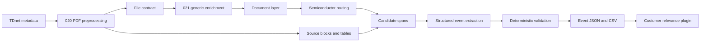
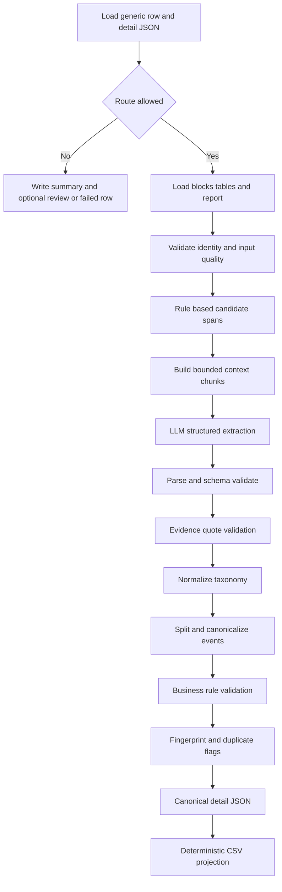

# 半導体マクロイベント抽出設計

**関連リンク**

- [半導体マクロイベント抽出・入力スキーマ解説](schema/semiconductor_macro_event_extraction_input_schema.md)
- [半導体マクロイベント抽出・入力スキーマYAML正本](schema/semiconductor_macro_event_extraction_input_schema.yaml)
- [半導体マクロイベント抽出・出力スキーマ解説](schema/semiconductor_macro_event_extraction_output_schema.md)
- [半導体マクロイベント抽出・出力スキーマYAML正本](schema/semiconductor_macro_event_extraction_output_schema.yaml)
- [汎用本文メタデータ・エンリッチメント設計](generic_body_metadata_enrichment_design.md)
- [汎用本文メタデータ・入力スキーマYAML正本](schema/generic_body_metadata_enrichment_input_schema.yaml)
- [汎用本文メタデータ・出力スキーマYAML正本](schema/generic_body_metadata_enrichment_output_schema.yaml)
- [スキーマ索引](schema/README.md)
- [同業マクロ影響イベントDB設計](peer_macro_event_db_design.md)
- 上流実装参照: `020_prop_candidates/notebook/tdnet_pdf_preprocessing.py`
- 直前工程実装参照: `notebook/generic_body_metadata_enrichment.py`

**目次**

- [1. 目的・原則・責務境界](#1-目的原則責務境界)
  - [1.1 文書の位置づけ](#11-文書の位置づけ)
  - [1.2 背景と目的](#12-背景と目的)
  - [1.3 設計原則](#13-設計原則)
  - [1.4 スコープと非対象](#14-スコープと非対象)
  - [1.5 リポジトリ境界と責務分離](#15-リポジトリ境界と責務分離)
- [2. 粒度・入力・ルーティング](#2-粒度入力ルーティング)
  - [2.1 処理粒度とイベント成立条件](#21-処理粒度とイベント成立条件)
  - [2.2 入力契約](#22-入力契約)
  - [2.3 既知の契約ギャップと吸収方針](#23-既知の契約ギャップと吸収方針)
  - [2.4 ルーティング](#24-ルーティング)
- [3. Taxonomy・イベントモデル](#3-taxonomyイベントモデル)
  - [3.1 taxonomyの構造](#31-taxonomyの構造)
  - [3.2 マクロテーマL1・L2](#32-マクロテーマl1l2)
  - [3.3 会社分類とイベント対象分類](#33-会社分類とイベント対象分類)
  - [3.4 value chain・device category・end market・financial metric・region](#34-value-chaindevice-categoryend-marketfinancial-metricregion)
  - [3.5 方向・影響・mechanism](#35-方向影響mechanism)
  - [3.6 イベントpayload](#36-イベントpayload)
- [4. 抽出アーキテクチャ](#4-抽出アーキテクチャ)
  - [4.1 hybrid抽出フロー](#41-hybrid抽出フロー)
  - [4.2 candidate span生成](#42-candidate-span生成)
  - [4.3 LLMコンポーネント分離](#43-llmコンポーネント分離)
  - [4.4 promptとstructured output](#44-promptとstructured-output)
  - [4.5 token・chunk・複数イベント](#45-tokenchunk複数イベント)
  - [4.6 retry・repair・fallback・部分失敗](#46-retryrepairfallback部分失敗)
- [5. 根拠・検証・品質管理](#5-根拠検証品質管理)
  - [5.1 根拠追跡](#51-根拠追跡)
  - [5.2 決定的バリデーション](#52-決定的バリデーション)
  - [5.3 confidenceとレビュー](#53-confidenceとレビュー)
- [6. 識別子・出力・バージョン](#6-識別子出力バージョン)
  - [6.1 event ID・fingerprint・重複管理](#61-event-idfingerprint重複管理)
  - [6.2 訂正開示の扱い](#62-訂正開示の扱い)
  - [6.3 出力成果物とprojection](#63-出力成果物とprojection)
  - [6.4 バージョニングとprovenance](#64-バージョニングとprovenance)
- [7. エラー・運用・テスト](#7-エラー運用テスト)
  - [7.1 エラー処理](#71-エラー処理)
  - [7.2 可観測性](#72-可観測性)
  - [7.3 セキュリティ・ライセンス](#73-セキュリティライセンス)
  - [7.4 テスト設計](#74-テスト設計)
- [8. 実装ロードマップ・レビュー](#8-実装ロードマップレビュー)
  - [8.1 MVP実装順序](#81-mvp実装順序)
  - [8.2 フェーズ1の非対象](#82-フェーズ1の非対象)
  - [8.3 レビュー観点](#83-レビュー観点)

---

## 1. 目的・原則・責務境界

### 1.1 文書の位置づけ

本書は、TDnet適時開示から半導体、半導体製造装置、検査・計測、半導体材料に関するマクロ、需給、設備投資イベントを抽出するフェーズ1の業務・処理設計を定義する。

- コンポーネント名: `semiconductor_macro_event_extraction`
- 配置先: 021リポジトリ
- 入力契約の正本: `schema/semiconductor_macro_event_extraction_input_schema.yaml`
- 出力契約の正本: `schema/semiconductor_macro_event_extraction_output_schema.yaml`
- 本書の状態: `design_complete`
- 設計版: `1.0.0`

型、必須・Nullable、enum、成果物、機械検証可能な制約はYAMLを正本とする。本書は、業務上の意味、抽出粒度、判定ロジック、処理順序、例外処理、運用上の判断を説明する。YAMLと本書が矛盾する場合はYAMLを優先し、矛盾自体を設計不備として修正対象にする。

---

### 1.2 背景と目的

汎用本文メタデータ層は、TDnetの1開示文書を1レコードとして、文書種別、粗いtopic、事業・財務イベント候補、根拠、後段ルーティングを生成する。そのままでは、1つの決算説明資料に同時に記載された「AIサーバー需要増」「NAND価格下落」「メモリ各社の設備投資抑制」「先端パッケージ能力増強」を、比較可能な別イベントとして扱えない。

本工程では、文書単位の汎用層を、半導体産業に特化したイベント単位へ展開する。

> どの会社の、どの開示で、どのマクロ現象が、どのvalue chain・device・end market・事業指標へ、どのmechanismで影響したか

成果物は、マクロ・需給・設備投資の時系列分析、企業間比較、アラート、経営ダッシュボードの中間データとして利用する。顧客固有の関心度は混ぜず、別プラグインで付与する。

---

### 1.3 設計原則

1. 実装と成果物は021に配置し、020をimport・変更・書込みしない。接続はファイル契約だけとする。
2. 上流は020のPDF前処理成果物と、021の汎用本文メタデータCSV・詳細JSONである。
3. 汎用層は1文書1レコード、本工程は1文書0..Nイベントである。
4. 原則として、1行は `1社 × 1開示 × 1マクロテーマ × 1事業影響` とする。
5. 原文根拠を持たないイベントは出力しない。
6. 金額がなくても、方向、影響対象、impact mechanismが原文で明示される場合はイベントとして許容する。
7. 明示されていない因果、企業分類、製品、顧客、地域、金額、期間を補完しない。
8. 顧客relevanceは本体taxonomyへ入れず、別プラグインで付与する。
9. 文書詳細JSONではなく、本工程のイベント詳細JSONをイベントpayloadの正本とする。CSVは同じpayloadから生成する決定的projectionである。
10. LLM出力をそのまま採用せず、根拠照合と決定的validatorを通す。
11. 抽出順、LLMの列挙順、chunk順に依存しないIDを使う。
12. 重複候補や訂正関係を観測可能にするが、自動マージしない。

---

### 1.4 スコープと非対象

#### 1.4.1 対象

- 半導体関連文書のルーティング
- ルールによるcandidate span生成
- LLMによる0..Nイベントの構造化抽出
- マクロテーマL1/L2の付与
- 会社属性とイベント対象の分離
- value chain、device、end market、地域、期間、方向、impact mechanismの抽出
- 金額、比率、数量、能力、稼働率など原文に明示された定量値の保持
- evidence ID、ページ、block/table source ID、引用文の追跡
- schema validation、業務制約validation、重複候補の識別
- CSV、詳細JSON、summary、failed、run reportの生成

#### 1.4.2 非対象

- PDF取得、OCR、Vision、table抽出
- 汎用文書分類の再実行
- 顧客別relevanceや推奨アクション
- 開示にない市場規模、予測、競合情報の外部補完
- 株価反応、投資判断、企業価値評価
- イベント間の自動因果推論
- 同一開示内、開示間、訂正前後の自動マージ
- EDINET、海外IR、ニュース、調査会社データの直接取込み
- 自由文からの無制限なtaxonomy追加

#### 1.4.3 フェーズ1成果物の境界

本フェーズ1で作成する成果物は、設計書と対応するYAML/MDスキーマだけである。prompt、設定ファイル、実装コード、notebook、テストコード、fixtureは作成しない。本書のhybrid flow、prompt、validator、テスト設計は、次フェーズで実装するための将来実装設計として残す。

---

### 1.5 リポジトリ境界と責務分離



020はPDF前処理のproducer、021の汎用工程は文書単位の索引producer、本工程は半導体イベントのconsumer兼producerである。本工程は020のPythonシンボル、定数、内部関数へ依存しない。入力パスは設定可能にするが、020側のファイルは読み取り専用とする。

顧客relevanceプラグインはイベント成果物を入力とし、顧客事業、競合関係、watch list、alert priorityなどを別namespaceで追加する。本工程のevent IDとtaxonomyは、特定顧客を変更しても不変である。

---

## 2. 粒度・入力・ルーティング

### 2.1 処理粒度とイベント成立条件

#### 2.1.1 粒度

- 汎用入力: 1行 = 1開示文書
- 本工程の主出力: 1行 = 1社 × 1開示 × 1マクロテーマ × 1事業影響
- 詳細JSON: 1ファイル = 1開示文書、内部に0..Nイベント
- summary: 1行 = 1入力文書
- failed: 1行 = 1処理失敗またはvalidation失敗
- report: 1ファイル = 1日または1実行

同一文中に複数テーマまたは複数影響対象がある場合は分割する。たとえば「AIサーバー需要増でHBM販売が増え、先端パッケージ投資も拡大」は、`end_market_demand × HBM販売` と `ai_datacenter_capex × 先端パッケージ設備投資` を別イベントにする。一方、同じテーマ・同じ対象・同じmechanismを複数文が裏付ける場合は、1イベントに複数evidenceを付ける。

#### 2.1.2 必須成立条件

イベントは次をすべて満たす。

1. `document_id` と発行会社を特定できる。
2. `macro_theme_l1` と、その配下の `macro_theme_l2` を特定できる。
3. 原文に明示されたマクロ現象または需給・設備投資変化がある。
4. 影響対象を、事業、製品、device、end market、地域、財務・操業指標の少なくとも1つで特定できる。
5. 1件以上の有効なevidenceがあり、quoteを上流本文へ照合できる。
6. 次のいずれかを満たす。
   - 原文に定量値が明示される。
   - 金額・数量はないが、`event_direction`、影響対象、`impact_mechanism` が明示される。
7. 原文から事業影響の方向を確定できない場合は `impact_direction=unclear` とし、reviewへ送る。根拠のない方向推定はしない。

単なる業界一般論、会社との接続がない市況説明、taxonomy語の羅列、将来可能性だけの推測はイベントにしない。

---

### 2.2 入力契約

詳細な型と必須条件は入力スキーマYAMLを正本とする。

#### 2.2.1 汎用本文メタデータCSV

日次またはrun集約CSVを受け取る。

```text
data/processed/tdnet_generic_body_metadata_enriched/{yyyymmdd}/generic_body_enriched_disclosure_metadata.csv
data/processed/tdnet_generic_body_metadata_enriched/generic_body_enriched_disclosure_metadata_all.csv
```

主な利用フィールド:

- `document_id`, `source_id`
- `disclosure_date`, `disclosure_time`
- `issuer_code`, `issuer_name`, `title`, `document_url`
- `status`, `document_type`
- `topic_tags`, `business_event_types`, `financial_impact_types`
- `body_confidence`, `evidence_ids`
- `text_extraction_quality`
- `downstream_priority`, `needs_structured_extraction`, `candidate_stage`
- `warning_codes`, `validation_errors`

#### 2.2.2 汎用本文メタデータ詳細JSON

```text
data/processed/tdnet_generic_body_metadata_enriched/{yyyymmdd}/documents/{document_id}/generic_body_metadata_enrichment.json
```

CSVで省略された完全なgeneric evidence、source IDs、page numbers、classification候補、signals、routing、quality、validationを取得する。CSVと詳細JSONの `document_id`、version、status、主要分類が一致しない場合は入力不整合として失敗させる。

#### 2.2.3 020 PDF前処理成果物

```text
data/processed/tdnet_pdf_preprocessed/{yyyymmdd}/documents/{document_id}/
  document_blocks.jsonl
  document_tables.jsonl
  processing_report.json
  normalized.md
```

- `document_blocks.jsonl`: quote照合とcandidate spanの主ソース
- `document_tables.jsonl`: 表内の数量、能力、投資額、稼働率、価格の補助ソース
- `processing_report.json`: 前処理status、本文品質、page/block/table件数
- `normalized.md`: 監査とoperator補助だけに使用

`document_tables.jsonl` はgeneric evidenceがtable IDを参照する場合だけ必須とし、それ以外の欠損は許容する。blocksが空、または文書IDが不一致なら処理しない。020の不動産向け `candidate_evidence_spans.jsonl` は本工程のcandidate生成に使用しない。

`normalized.md` はcanonical evidence、candidate span、抽出fallbackに使用しない。LLMへの全文投入を禁止し、operatorによる手動監査またはresolver troubleshootingのための限定的な抜粋参照だけを許容する。

---

### 2.3 既知の契約ギャップと吸収方針

現行実装とYAML上の一般化された契約には差がある。adapterで明示的に吸収し、producerの実装詳細を暗黙に仮定しない。

| ギャップ | 現行の観測 | 本工程の扱い |
|---|---|---|
| 020の `source_id` | 現行の `normalized.md` front matterと `evidence_package.json` のいずれにも出力されない | 汎用本文メタデータCSV・詳細JSONの `source_id` を正とし、020前処理成果物とは `document_id` だけでjoinする |
| 前処理失敗時report | `processing_status=failed` の `processing_report.json` は実装上生成されない | `processing_failed.csv` / `processing_failed_all.csv` または文書ディレクトリ不存在として扱う |
| 成功report status | 実生成は `success` または `success_with_warnings` | `failed` reportの存在を前提にしない |
| blocks enum | 実生成は主に `document_title`, `page_title`, `section_heading`, `paragraph`, `bullet`, `note`, `header`, `footer`, `unknown` のsubset | `slide_title`, `heading`, `table` 等が必ず来ると仮定せず、未知値はwarningまたはschema方針に従う |
| 表 | 表は主に `document_tables.jsonl` に分離 | block側の `table` を必須にしない |
| generic evidence順 | 詳細JSONのevidenceは `quality_score` 優先で順位付けされる | 文書順とは解釈せず、page/source IDで本文順を再構成する |
| CSV boolean | CSV読込み後は文字列になり得る | 許容表現を固定して明示的にparseし、Python等の文字列truthinessを使わない |
| CSV JSON-array | `topic_tags`, `evidence_ids` 等はJSON文字列 | JSON arrayとしてparseし、区切り文字分割や評価関数を使わない |

producer baselineに合わせ、入力CSV booleanはcase-sensitiveな `True` / `False` だけを許容する。`true`, `false`, `1`, `0`、空文字、その他の未知値は `invalid_csv_boolean` とし、値や大文字小文字を正規化して受理しない。壊れたJSONもfalseや空配列へ黙って変換せず、入力validation errorとする。

---

### 2.4 ルーティング

#### 2.4.1 status guard

処理対象は汎用層の `status` が次の場合だけである。

- `success`
- `needs_review`

上流の `failed_validation` は抽出禁止とする。主CSVに行があってもLLMへ送らず、summaryは `status=skipped`, `error_code=generic_failed_validation` として記録する。汎用工程のruntime failureで主CSV行がない文書も抽出対象にしない。

#### 2.4.2 基本条件

既定では `needs_structured_extraction=true` を必要条件とする。運用設定により、監査・taxonomy評価用にfalseの文書をルール抽出だけへ通すことはできるが、通常運用ではLLM対象にしない。

`downstream_priority` の許容値は設定化する。

- 既定: `high`, `medium`
- 精度評価時の任意追加: `low`
- `skip`: 常に対象外

`low` を許容しても、`text_extraction_quality=low` はLLMへ送らない。

#### 2.4.3 低品質本文

`text_extraction_quality=low` は以下とする。

- LLM呼出し禁止
- 既定decisionは `review_only`
- 設定により `skip`
- 根拠quoteのsubstring照合を通せるルールベース候補があっても、自動acceptedにはしない

#### 2.4.4 document type優先度

初期の優先度は以下とする。設定で追加・除外・順序変更できる。

| 優先度 | `document_type` |
|---|---|
| 最優先 | `earnings_presentation`, `earnings_release`, `forecast_revision` |
| 高 | `business_plan`, `capex_fixed_assets` |
| 中 | `ma_restructuring`, `business_alliance`, `impairment`, `legal_regulatory` |
| 低 | `sustainability`, `financing_capital_policy`, `other` |
| 設定追加時のみ | `operating_update` |
| 原則除外 | `dividend_shareholder_return`, `governance_personnel` |

原則除外でも、汎用根拠に設備、需給、輸出規制等の明示的シグナルがあり、設定で許可された場合はcandidate生成まで行える。

#### 2.4.5 selection decisionとsummary

入力1文書ごとに、入力YAML正本の `selected`, `skipped`, `review_only`, `failed_precheck` のいずれかを決める。routingだけで `skipped` または `review_only` になった文書、入力整合性検査で `failed_precheck` になった文書も、必ずsummaryへ1行出す。

- `selected`: LLMを呼出し、canonical生成へ進む
- `skipped`: LLMを呼ばず、canonicalを作らない
- `review_only`: LLMを呼ばず、summaryとreview queueへ出し、canonicalを作らない
- `failed_precheck`: LLMを呼ばず、summaryとfailedへ出し、canonicalを作らない

summaryの `canonical_json_path` はcanonicalを作らないdecisionではnullとする。入力件数は、canonical件数だけでなく、これらのsummary行を含めて収支を合わせる。

---

## 3. Taxonomy・イベントモデル

### 3.1 taxonomyの構造

taxonomyの正本は出力YAML `schema/semiconductor_macro_event_extraction_output_schema.yaml` とする。設計書内の列挙値は出力YAMLと完全一致させ、親子関係を持つテーマ階層と、相互に直交する分析軸を分ける。

- 階層軸: `macro_theme_l1` → `macro_theme_l2`
- 対象軸: `semiconductor_value_chain`, `device_category`, `end_market`, `region`
- 会社属性軸: source metadataの `issuer_value_chains`
- 変化軸: `event_direction`
- 事業影響軸: top-level `impact_direction`, `impact_strength`, `impact_scope`, `impact_mechanism`
- 時間軸: `actual_or_forecast`, `time_horizon`
- 財務軸: `financial_impacts[].financial_metric`, `financial_impacts[].impact_direction`

L2は必ずL1配下のcontrolled vocabularyから選ぶ。複数L1にまたがる記述は、事業影響ごとにイベントを分ける。主テーマを恣意的に1つ選んで情報を潰さない。

`null` は「記載なし」または「非該当」を意味する。`other` は「原文で対象が明示されているが、現行taxonomyの列挙値にない」を意味する。`other` を使う場合は対応する `*_raw` を必須とする。特に `device_category=other` では `device_category_raw`、`end_market=other` では `end_market_raw` をnon-nullとする。正規化値がnullなら対応rawも原則nullとし、記載がない情報を `other` やrawだけで補わない。

---

### 3.2 マクロテーマL1・L2

L1はフェーズ1で固定する。L2は出力YAML正本の `macro_theme_l2_by_l1` と完全一致させる。L2追加は `taxonomy_version` を更新し、既存値の意味変更は行わない。

#### 3.2.1 `end_market_demand`

```text
ai_server_demand
hyperscaler_demand
pc_smartphone_demand
automotive_ev_demand
industrial_demand
consumer_electronics_demand
telecom_demand
other_end_market_demand
```

#### 3.2.2 `ai_datacenter_capex`

```text
ai_server_investment
hyperscaler_capex
datacenter_capex
ai_accelerator_investment
datacenter_power_infrastructure
other_ai_datacenter_capex
```

#### 3.2.3 `semiconductor_cycle`

```text
cycle_upturn
cycle_downturn
demand_recovery
demand_slowdown
supply_demand_balance
other_semiconductor_cycle
```

#### 3.2.4 `memory_pricing`

```text
dram_pricing
nand_pricing
hbm_pricing
memory_contract_pricing
memory_spot_pricing
other_memory_pricing
```

#### 3.2.5 `inventory`

```text
inventory_build
inventory_adjustment
inventory_normalization
channel_inventory
customer_inventory
other_inventory
```

#### 3.2.6 `customer_capex`

```text
foundry_capex
memory_capex
wfe_capex
logic_capex
other_customer_capex
```

#### 3.2.7 `capacity_supply`

```text
utilization
new_fab
capacity_expansion
capacity_reduction
supply_shortage
oversupply
other_capacity_supply
```

#### 3.2.8 `technology_transition`

```text
node_transition
gaa
advanced_packaging
euv
sic_gan
hbm_transition
other_technology_transition
```

#### 3.2.9 `fx`

```text
yen_appreciation
yen_depreciation
currency_translation
transaction_fx
other_fx
```

#### 3.2.10 `input_cost`

```text
energy_cost
material_cost
silicon_wafer_cost
chemical_gas_cost
labor_cost
other_input_cost
```

#### 3.2.11 `geopolitics_export_control`

```text
export_control
china_us_geopolitics
tariff_trade_restriction
economic_security
regional_conflict
other_geopolitics
```

#### 3.2.12 `industrial_policy_subsidy`

```text
semiconductor_subsidy
tax_incentive
domestic_fab_policy
localization_policy
other_industrial_policy
```

#### 3.2.13 `logistics_supply_chain`

```text
logistics_disruption
lead_time_change
supplier_disruption
procurement_constraint
supply_chain_normalization
other_logistics_supply_chain
```

#### 3.2.14 `financial_conditions`

```text
interest_rate
funding_cost
credit_availability
liquidity_conditions
other_financial_conditions
```

---

### 3.3 会社分類とイベント対象分類

`issuer_value_chains` は開示会社の半導体産業上の位置づけであり、canonical documentのsource metadata側に置く。会社属性を表す配列・nullableのフィールドとし、原文表現はsource metadataの `issuer_value_chain_raw` へ保持する。

`semiconductor_value_chain` は、そのイベントで影響を受ける、または変化を起こす対象である。イベント単位の単一・nullableフィールドとする。同じ装置メーカーの開示でも、「foundryの投資抑制」は `semiconductor_value_chain=foundry`、「自社装置売上への影響」はimpact target側で装置事業を表す。

例:

- 開示会社: 装置メーカー → source metadataの `issuer_value_chains=["semiconductor_equipment"]`
- マクロ現象の対象: メモリ顧客の設備投資削減 → `semiconductor_value_chain=memory`
- event側の原文対象 → `semiconductor_value_chain_raw`

issuer分類とevent対象を自動コピーしない。開示原文または契約上許可されたsource metadataにないissuer分類をLLMで補完しない。issuer分類を確定できなければ `issuer_value_chains=null` とし、推測値を入れない。event対象が原文にない場合は `semiconductor_value_chain=null` とする。

---

### 3.4 value chain・device category・end market・financial metric・region

#### 3.4.1 `value_chain`

```text
idm
fabless
foundry
memory
logic
analog
power_semiconductor
semiconductor_equipment
inspection_metrology
semiconductor_materials
silicon_wafer
electronic_components
osat_packaging_test
semiconductor_distributor
facility_infrastructure
other
```

同じenumをsource metadataの `issuer_value_chains` の各要素と、event側の `semiconductor_value_chain` に使用する。ただし両者の意味とrawフィールドは分離する。

#### 3.4.2 `device_category`

```text
dram
nand
hbm
logic
mcu
analog
power
sensor
foundry_service
equipment
materials
wafer
packaging
other
```

#### 3.4.3 `end_market`

```text
ai_server
datacenter
smartphone
pc
automotive
industrial
consumer_electronics
telecom
medical
defense_aerospace
other
```

L2とend marketは役割が異なる。たとえば `macro_theme_l2=ai_server_demand` は現象の分類、`end_market=ai_server` は対象市場の分類である。

#### 3.4.4 `financial_metric`

```text
revenue
operating_profit
gross_margin
net_income
capex
inventory
inventory_days
orders
backlog
shipments
asp
utilization_rate
production_capacity
wafer_starts
book_to_bill
free_cash_flow
```

#### 3.4.5 `region`

```text
japan
north_america
europe
china
taiwan
south_korea
asia_ex_china
global
other
```

#### 3.4.6 raw併記

issuer側は `issuer_value_chain_raw`、event側は `semiconductor_value_chain_raw` を使い、同じrawフィールドへ混在させない。`semiconductor_value_chain=other` の場合は `semiconductor_value_chain_raw`、`region=other` の場合は `region_raw` をnon-null必須とする。rawはquoteの代替ではなく、原文表現の保持に使う。

---

### 3.5 方向・影響・mechanism

#### 3.5.1 `event_direction`

マクロ現象そのものの変化方向を表す。

```text
increase
decrease
improving
deteriorating
tightening
easing
stable
mixed
unclear
```

例:

- メモリ価格が上昇 → `increase`
- 在庫調整が進展 → `improving`
- 輸出規制が強化 → `tightening`
- 供給制約が緩和 → `easing`

positive/negativeを使わない。需要増は通常 `increase` だが、その会社への影響が正か負かは別問題である。

#### 3.5.2 `impact_direction`

開示会社の事業、製品、操業、財務指標への効果を表す。

```text
positive
negative
mixed
neutral
unclear
```

`event_direction` から機械的に決めない。たとえば材料価格上昇は、材料メーカーの販売価格にはpositiveでも、装置メーカーの製造原価にはnegativeとなり得る。原文が因果を述べない場合は `unclear` とする。

#### 3.5.3 `impact_mechanism`

事業影響が生じる経路をcontrolled vocabularyで表す。

```text
volume_up
volume_down
asp_up
asp_down
cost_up
cost_down
margin_up
margin_down
utilization_up
utilization_down
inventory_increase
inventory_reduction
capacity_expansion
capacity_reduction
order_increase
order_decrease
backlog_increase
backlog_decrease
supply_constraint
technology_mix_improvement
technology_obsolescence
capex_increase
capex_decrease
```

`impact_mechanism` は単一enumである。複数mechanismが独立した影響を表す場合はイベントを分割する。YAMLにない独自値や `other` は使用しない。

---

### 3.6 イベントpayload

出力フィールドの型、必須・Nullable、enumは出力スキーマYAMLを正本とする。canonical documentは次のgroupを持つ。

#### 3.6.1 canonical document

- `schema_version`, `extraction_version`, `taxonomy_version`
- `document_id`
- `source_metadata`
- `input_versions`
- `extraction_provenance`
- `extraction_status`
- `events`
- `warnings`
- `validation`
- `generated_at_utc`

source metadataのrequired keyは `source_id`, `disclosure_date`, nullableの `disclosure_time`, `issuer_code`, `issuer_name`, `title`, `document_url`, `document_type`, `issuer_value_chains`, `issuer_value_chain_raw` である。issuer分類はevent配下に重複保持しない。

#### 3.6.2 top-level event

各eventは少なくとも次を持つ。

- `event_id`, `dedup_key`
- `macro_theme_l1`, `macro_theme_l2`
- `event_direction`
- `impact_direction`
- `impact_strength`
- `time_horizon`, `actual_or_forecast`
- `impact_scope`, `impact_mechanism`
- `normalized_summary`
- `semiconductor_value_chain`, `semiconductor_value_chain_raw`
- `company_segment_raw`, `company_product_raw`
- `normalized_segment`, `normalized_product_group`
- `device_category`, `device_category_raw`, `technology_node`
- `end_market`, `end_market_raw`, `customer_group`
- `region`, `region_raw`
- `financial_impacts`
- `evidence_refs`
- `confidence`, `needs_human_review`, `review_reasons`

top-level eventの `impact_direction` は必須であり、マクロ現象が開示会社の事業へ与えるbusiness effectを表す。`event_direction` と同一視せず、根拠が曖昧なら `unclear` としてreview対象にする。

#### 3.6.3 `financial_impacts[]`

各financial impactは次を持つ。

- `financial_metric`
- `impact_direction`
- `amount_value`, `amount_unit`
- `period`
- `actual_or_forecast`
- `offsetting_factor`

event top-levelの `impact_direction` は事業全体への効果、`financial_impacts[].impact_direction` は個別財務指標への効果である。たとえば事業影響がmixedでも、`revenue=positive`, `gross_margin=negative` を別々に保持できる。金額がない場合は `amount_value` と `amount_unit` をともにnullとし、片方だけを設定しない。

#### 3.6.4 extraction provenance

`extraction_provenance.llm_called` を必須とする。

- `llm_called=false`: candidateなしで決定的に `no_event_found` とした場合など。provider、model、model version、prompt version、temperature、token usage、costは必須にせずnullを許容する。
- `llm_called=true`: provider、model、prompt version、context set version、temperature、attempt count、fallback、入力evidence、context hashを必須とする。model version、token usage、latency、costはproviderが返す範囲で保持する。

`context_set_version` はtop-level versionではなくprovenance内の独立したversionである。LLM未呼出しの `no_event_found` に架空のprovider/model値を入れない。

---

## 4. 抽出アーキテクチャ

### 4.1 hybrid抽出フロー



hybrid方式では、ルールが候補箇所を絞り、LLMは候補文脈内の関係抽出と構造化を担う。LLMに全文を無条件投入せず、`normalized.md` はpromptへ使用しない。ルールだけで最終イベントを確定もしない。抽出後のtaxonomy制約、quote照合、ID生成、projectionは決定的処理とする。

---

### 4.2 candidate span生成

#### 4.2.1 入力ソース

候補は次を統合する。

1. generic detail JSONのevidence
2. generic classificationのtopic・business event・financial impact signals
3. blocksの半導体taxonomy語、方向語、因果語、定量語
4. tablesの見出し・セル
5. タイトル、section heading、page title

generic evidenceはquality順であり、本文順ではない。candidate spanの並びは `page_number`, block/table order, source IDで再構成する。

#### 4.2.2 span境界

- 見出し: 見出しと後続2〜4 blocks
- 本文: hit blockと前後1〜2 blocks
- bullet: 同じ見出し配下の隣接bullet
- table: table、直前見出し、直前説明block、直後注記
- page跨ぎ: 前ページ末尾と次ページ先頭が同一sectionと判定できる場合だけ許容

spanには `candidate_span_id`, `source_ids`, `page_numbers`, `text`, `normalized_text`, `trigger_terms`, `generic_evidence_ids`, `quality` を持たせる。これらはcandidate/evidence検証用の内部中間表現であり、canonical eventへそのまま出力しない。header/footer、目次、免責、連絡先は既定で除外する。

#### 4.2.3 候補採用

単一キーワードだけでなく、次の組合せを優先する。

- theme語 + direction語
- theme語 + impact target語
- capex/capacity語 + 金額・能力・時期
- device/end market語 + 需要・価格・在庫・投資語
- 規制・補助金語 + 対象地域・製品・設備

候補が0件なら正常な0イベントとして扱う。無理にLLMへ全文を渡してイベントを作らない。

---

### 4.3 LLMコンポーネント分離

責務を次の単位へ分離する。

- `source adapter`: CSV、JSON、blocks、tables、reportの差を吸収。normalizedは監査補助に限定
- `router`: status、priority、品質、document typeで実行可否を決定
- `candidate span builder`: 決定的ルールで候補を生成
- `context builder`: spanをtoken上限内のchunkへ構成
- `prompt builder`: taxonomy、制約、出力schema、候補文脈を組み立て
- `LLM adapter`: provider API、timeout、retry、response metadataを吸収
- `extractor`: 0..Nのstructured event候補を要求
- `parser`: structured JSONを安全にparse
- `normalizer`: controlled vocabulary、raw、期間、数値表現を正規化
- `validator`: schema、根拠、業務制約を決定的に検証
- `projector`: canonical payloadからCSVを生成

provider固有のresponse形式やmodel名をextractor・validatorへ漏らさない。LLMなしのmock adapterで全後段処理をテストできる構造にする。

---

### 4.4 promptとstructured output

promptは最低限次を含む。

1. 対象はTDnet開示内で明示された事実・見通しだけである。
2. 出力は0..Nイベントであり、イベントがなければ空配列を返す。
3. 1イベントは1マクロテーマ×1事業影響へ分割する。
4. quote、source ID、pageを必須とする。
5. quoteにない会社、製品、地域、数値、因果、方向を推測しない。
6. event directionとimpact directionを混同しない。
7. nullとotherを使い分け、otherにはrawを付ける。
8. 金額なしイベントの成立条件を守る。
9. 同じ根拠から複数イベントを返せる。
10. JSON schemaに適合するstructured outputだけを返す。

prompt本文には `prompt_template_id` と `prompt_version` を持たせる。taxonomy全文はversion管理されたcontext setとして注入し、`context_set_version` で識別する。provider側structured output機能がある場合は利用するが、後段validatorを省略しない。

---

### 4.5 token・chunk・複数イベント

- providerのcontext上限から、system、schema、taxonomy、response予約分を差し引いてchunk上限を決める。
- 1chunkは可能な限りsection境界を保つ。
- 長いtableは見出し行、対象行、注記を優先し、切断情報を記録する。
- 同じspanを複数chunkへ重複配置する場合はoverlapと元source IDsを保持する。
- 1chunkから複数eventを許容する。
- 複数chunkから同じevent候補が出ても、抽出順で消さずfingerprintとdedup keyで候補関係を付ける。
- 文書全体のイベント上限、chunk数上限、response token上限は設定化する。
- 上限超過で未処理spanが残った場合はcanonical `extraction_status=needs_review` とし、専用の `partial` statusは作らない。未処理範囲をwarningとreview reasonへ記録する。

---

### 4.6 retry・repair・fallback・部分失敗

#### 4.6.1 retry

timeout、rate limit、一時的provider errorは指数backoffとjitterで再試行する。最大回数を超えたら文書またはchunkの失敗として記録する。認証、quota、無効model、無効requestは無条件retryしない。

#### 4.6.2 repair

JSON parseまたはschema validationに失敗した場合、元responseとvalidation errorだけを使った1回のrepairを許容する。新しい本文情報を追加せず、意味変更や根拠追加を要求しない。repair responseにもmodel・usage・request IDを記録する。

#### 4.6.3 fallback

structured output非対応または継続的失敗時は、次の順で安全側へ倒す。

1. 同一modelの厳格JSON mode
2. 設定されたfallback model
3. rule-based candidateをreview queueへ保存
4. イベント主出力には未検証候補を出さない

#### 4.6.4 部分失敗

chunk単位成功を許容するが、文書payloadに未処理・失敗chunkを列挙する。成功chunkのイベントは、成立条件とvalidationを満たす場合だけ出力できる。独立した `partial` statusは作らず、canonical `extraction_status=needs_review` とし、`partial_chunk_failure` warningと対応するreview reasonで完全成功と区別する。

---

## 5. 根拠・検証・品質管理

### 5.1 根拠追跡

#### 5.1.1 evidence ID

本工程のevidenceは上流sourceへ参照可能にする。以下のうち `generic_evidence_ids`, `normalized_quote`, `context_text` はcandidate生成・quote照合・claim検証だけに使う内部中間表現であり、canonical出力契約には含めない。canonical `evidence_ref` は出力YAMLに定義された `evidence_id`, `source_type`, `source_ids`, `page_numbers`, `quote` の5 fieldだけである。

- `evidence_id`: 本工程内の不変な根拠ID
- `generic_evidence_ids`: 汎用詳細JSONの根拠ID
- `source_type`: `block`, `table`, `mixed`
- `source_ids`: block ID、table ID
- `page_numbers`
- `quote`
- `normalized_quote`
- `context_text`

#### 5.1.2 quote検証

quoteは次の順で検証する。

1. 指定source IDの原文にexact substringとして存在
2. Unicode NFKC、改行・空白圧縮後にnormalized substringとして存在
3. tableの場合、セル連結規則に従うnormalized match

3段階すべてに失敗したquoteは無効である。fuzzy semantic matchだけでは採用しない。normalized matchを使った場合はwarningと照合方式を残す。

#### 5.1.3 複数根拠

1イベントに1〜8件のevidenceを許容する。9件以上の候補がある場合は、必須fieldの支持範囲、exact quote一致、source品質、独立性の順で決定的に8件へ絞り、切り捨てた根拠IDをwarningへ記録する。validatorは根拠集合がtheme、event direction、top-level impact direction、対象、mechanism、financial impactの各claimを支持するか検査する。イベント成立条件に必要なfieldが根拠集合のどこからも支持されない場合はvalidation errorとする。この検査用対応関係をYAMLにないevent出力fieldとして追加しない。

---

### 5.2 決定的バリデーション

#### 5.2.1 入力

- 汎用CSVと詳細JSONの `document_id` 一致
- generic statusが `success` または `needs_review`
- `failed_validation` の抽出禁止
- version、必須フィールド、JSON-array、booleanのparse
- 前処理directory、blocks、reportの存在
- blocks/tables/reportのdocument ID整合
- 本文品質とrouting設定の整合

#### 5.2.2 schema

- 必須、型、Nullable、enum、pattern、範囲
- L2が指定L1配下にある
- `other` とrawの組合せ
- `confidence` が0.0〜1.0
- version値の形式
- `financial_impacts` のmetric、direction、amount value/unit pair、period整合

#### 5.2.3 イベント成立

- evidenceが1件以上
- quote照合成功
- theme、現象、影響対象が根拠で支持される
- top-level `impact_direction` が必須で、business effectとして根拠に支持される
- 定量値あり、または方向・対象・mechanismが明示
- 1イベントに複数の独立theme・impactが混在しない
- impact directionをevent directionから推測していない
- raw quoteにない固有名詞・数値・期間を含まない

#### 5.2.4 projection

- JSONL/CSV各行がcanonical JSONのeventへ1対1で解決
- JSONL/CSV event IDが一意
- JSON-array列が決定的な順序と直列化規則に従う
- booleanが正規化された物理表現になる
- CSVにdetail-only情報を混入しない
- 同じpayloadから再生成したCSVがbyte単位または定義済み正規化後に一致

validation errorのあるイベントはJSONL/CSVへ出さない。文書内の一部candidateだけが無効な場合も独立statusは作らず、canonical `needs_review` とwarning/review reasonで表す。

---

### 5.3 confidenceとレビュー

confidenceはLLMの自己申告確率ではない。決定的に計算する品質指標とする。初期要素は以下である。

- quote exact match
- theme、direction、target、mechanismの根拠充足
- 複数独立根拠の整合
- タイトル・見出し・本文・表のsource強度
- 上流text quality
- normalized match使用
- conflicting evidence
- `unclear`, `other`, nullの重要field
- partial chunk failure

reviewを必須とする代表条件:

- 上流 `needs_review`
- text qualityがlow
- normalized matchのみ
- impact directionがunclear
- L2または主要対象がother
- conflicting evidence
- `partial_chunk_failure` warning
- duplicate candidate
- 訂正開示関係
- threshold未満のconfidence

confidence閾値は設定化し、taxonomy versionとは分離する。閾値変更は `extraction_version` を更新する。

---

## 6. 識別子・出力・バージョン

### 6.1 event ID・fingerprint・重複管理

#### 6.1.1 canonical event fingerprint

fingerprintは少なくとも次を正規化して作る。

- `macro_theme_l1`, `macro_theme_l2`
- `event_direction`, `impact_direction`
- `impact_scope`, `impact_mechanism`
- `semiconductor_value_chain`
- `company_segment_raw`, `company_product_raw`
- `normalized_segment`, `normalized_product_group`
- `device_category`, `technology_node`
- `end_market`
- `customer_group`
- `region`
- `time_horizon`, `actual_or_forecast`
- canonicalized `financial_impacts`

分類、対象、direction、mechanism、期間、financial impactをidentityへ使う。`impact_strength` は抽出品質・review判断で再評価され得る属性であり、強度ラベルだけの再評価でevent identityを変えないためfingerprintから意図的に除外する。配列は意味上順序を持たないものだけsortし、null、空文字、空配列の正規形を固定する。`normalized_summary` と `evidence_refs` もidentity fingerprintから明示的に除外する。raw quote、confidence、LLM抽出順、evidence列挙順、generated timestampも含めない。したがって、要約文の言い換え、同じ根拠集合の列挙変更、または `impact_strength` だけの再評価ではevent IDは変わらない。

#### 6.1.2 `event_id`

`event_id` は `document_id + canonical_event_fingerprint` から暗号学的hashで決定的に生成する。同じ入力payloadを再処理した場合、抽出順、chunk順、要約表現、evidence列挙順が変わってもidentity fieldが同じなら同じIDになる。

同一文書内で同じfingerprintの候補が複数ある場合、根拠を統合可能な候補としてflagするが、自動マージはしない。ID衝突を避けるため、区別が必要な場合は原文で明示されたperiodまたはimpact targetの正規化不足を先に解消する。

#### 6.1.3 `dedup_key`

`dedup_key` は開示間の類似候補探索用であり、event IDとは別である。issuer、theme、対象、direction、mechanism、期間等から作り、`document_id` とfinancial impact詳細をidentity fingerprintとは異なる規則で扱う。dedup key一致は同一イベントの証明ではない。

#### 6.1.4 重複方針

- 同一開示内: 候補関係を記録し、自動マージしない
- 異なる開示間: 重複・継続候補として内部またはreview queueで扱い、自動マージしない
- 決算短信と説明資料: 同日・同内容でも別eventを維持
- 再抽出: 同じdocument ID・fingerprintなら同じevent ID

フェーズ1のcanonical event出力契約に含むrelationship/identity fieldは `event_id`, `dedup_key` までである。`possible_duplicate`, `possible_continuation` 等のrelationship fieldは出力YAMLにないフェーズ2以降の非契約案であり、フェーズ1payloadへ追加しない。

---

### 6.2 訂正開示の扱い

TDnetの `update_history`、タイトルの「訂正」、source metadata、開示日時から訂正関係候補を作る構想はフェーズ2以降とする。

- `correction_status`: `original`, `correction`, `unknown`
- `corrects_document_id`: 特定できる場合だけ設定
- `correction_relation_confidence`
- `correction_relation_evidence`

フェーズ2以降でも、訂正版があっても原イベントを削除・上書きせず双方を保持し、`supersedes_candidate` は関係候補としてのみ扱う。数値や方向が変わった場合は別event IDとなり得る。訂正関係が曖昧なら自動決定せずreviewへ送る。

`correction_status`, `corrects_document_id`, `correction_relation_confidence`, `correction_relation_evidence`, `supersedes_candidate` はいずれも出力YAMLにないフェーズ2以降の非契約案である。フェーズ1canonicalには出力せず、訂正候補を検知してもeventを自動マージ・上書きしない。

---

### 6.3 出力成果物とprojection

出力ルートは出力YAML正本と同じ次の値に固定する。

```text
data/processed/tdnet_semiconductor_macro_events_extracted/
  {yyyymmdd}/
    documents/{document_id}/semiconductor_macro_event_extraction.json
    semiconductor_macro_events.jsonl
    semiconductor_macro_events.csv
    semiconductor_macro_event_extraction_summary.csv
    semiconductor_macro_event_extraction_failed.csv
    semiconductor_macro_event_review_queue.csv
    daily_semiconductor_macro_event_extraction_report.json
  semiconductor_macro_events_all.jsonl
  semiconductor_macro_events_all.csv
  semiconductor_macro_event_extraction_summary_all.csv
  semiconductor_macro_event_extraction_failed_all.csv
  semiconductor_macro_event_review_queue_all.csv
  semiconductor_macro_event_extraction_report_all.json
```

文書canonical JSONは、入力version、source metadata、抽出provenance、0..N event、validation、warningを保持する正本である。runtime failure、`skipped`, `review_only`, `failed_precheck` はcanonicalを作らない。

日次・run集約のJSONLとCSVは同じcanonical eventの決定的projectionである。抽出処理を別に実行しない。JSONLの各行はcanonical文書からのlossless envelopeで、`schema_version`, `extraction_version`, `taxonomy_version`, `document_id`, `source_metadata`, `extraction_status`, `extraction_provenance`, `event` をrequired propertiesとして持つ。配列・objectはnative JSONのまま保持し、1行1event、eventなし文書は0行とする。CSVはその同じcanonical eventをフラット化し、配列・object列だけを固定規則のJSON文字列として直列化する。projection後にcanonical JSONとの参照整合を検証する。

`no_event_found` 文書は `events=[]` のcanonicalを作り、主イベントJSONL/CSVには行を作らず、summaryへ1行残す。review対象eventはreview queueへ1行ずつ出す。runtime failureはcanonicalと主イベント行を作らず、summaryとfailedへ記録する。

---

### 6.4 バージョニングとprovenance

4種類のversionを分離する。

- `schema_version`: `1.0.0`。構造、型、enum参照、意味の版
- `extraction_version`: `YYYY-MM-DD.NNN`。ルール、閾値、prompt、正規化、validator実装の版
- `taxonomy_version`: Semantic Versioning。現行値は `1.0.0`
- `context_set_version`: LLMへ渡す定義、few-shot、禁止事項、辞書の集合版

`YYYY-MM-DD.NNN` 形式を使うのは `extraction_version` だけである。taxonomy変更はSemVer、context set変更は独立した `context_set_version` として追跡し、extraction versionへ混同しない。

全canonical JSON、JSONL、CSV、summary、reportにYAMLが要求するversionを記録する。`extraction_provenance` は常に `llm_called` を持ち、LLMを呼んだ場合だけ次を必須にする。

- `provider`, `model`, `model_version`
- `prompt_version`, `context_set_version`
- `temperature`, `attempt_count`, `fallback_used`
- `token_usage`, `input_evidence_ids`, `context_hashes`
- `latency_ms`, `cost`

LLM未呼出しではprovider/model等を架空値で埋めず、nullまたは条件付き省略とする。共通lineageとして次を保持する。

- source generic schema/enrichment version
- source preprocessing artifact hashまたは識別情報

providerがmodel snapshotを返さない場合は、指定model名と実行日時を保持し、「同一model名なら完全再現可能」とはみなさない。

---

## 7. エラー・運用・テスト

### 7.1 エラー処理

機械判定可能なprefixを使う。

```text
invalid_generic_csv_value
invalid_csv_boolean
missing_generic_detail_json
generic_csv_json_mismatch
generic_failed_validation
missing_preprocessing_artifact
preprocessing_document_not_found
document_identity_mismatch
low_text_quality
invalid_block_or_table
candidate_generation_failed
llm_timeout
llm_rate_limited
llm_auth_error
llm_quota_error
llm_invalid_response
structured_output_parse_failed
structured_output_schema_failed
quote_not_found
taxonomy_validation_failed
event_invariant_failed
projection_mismatch
partial_chunk_failure
unexpected_error
```

1文書または1chunkの失敗でrun全体を停止しない。schema、taxonomy、設定、出力root等のrun共通前提が不正な場合は開始前にfail fastする。エラー本文にprompt全文、開示全文、認証情報を出さない。

---

### 7.2 可観測性

日次・run reportには以下を含める。

- input、routed、skipped、review、processed文書数
- `success`, `no_event_found`, `needs_review`, `failed_validation`, runtime `failed` 文書数
- accepted、rejected event数
- 文書当たりevent数分布
- L1/L2、event/impact direction、value chain、device category、end market、financial metric、region分布
- document type、priority、text quality別件数
- quote exact/normalized/failed件数
- other/null率
- duplicate・correction候補数
- chunk数、token、latency、retry、repair、fallback
- provider/model別成功率と費用推計
- error code別件数
- schema/extraction/taxonomy/context set version
- 開始・終了時刻、処理時間、入出力パス

過去runとのtaxonomy分布、0イベント率、rejected率、normalized quote率の差を監視し、prompt・model・taxonomy回帰を検知する。

---

### 7.3 セキュリティ・ライセンス

- TDnet公開開示を入力とする。
- API key、認証情報をnotebook、prompt、成果物、ログへ保存しない。
- LLM providerへ送信可能なデータ範囲を設定と運用手順で明示する。
- ログへ本文全文・prompt全文・response全文を出さない。
- 詳細JSONにprovider raw responseを保存する場合は、アクセス制御、保持期限、暗号化方針を定める。
- URL、document ID、evidence、page/source IDを保持し、出所追跡を可能にする。
- 外部taxonomy・辞書・few-shot例のライセンスと出典を記録する。
- prompt injectionとして解釈され得る開示本文を命令として扱わず、引用データとして境界を分離する。

---

### 7.4 テスト設計

#### 7.4.1 unit

- CSV booleanのcase-sensitiveな `True` / `False`、小文字、1/0、空、不正値
- JSON-arrayの正常、空、不正、非配列
- L1-L2親子制約
- nullとother、raw必須
- directionとimpact directionの分離
- candidate span境界と本文順再構成
- quote exact/normalized/table match
- canonicalization、fingerprint、event IDの順序非依存性
- dedup keyとevent IDの差
- confidence境界

#### 7.4.2 schema

- input/output YAML適合
- 必須、Nullable、enum、version format
- structured LLM responseの適合・不適合
- detailed JSONとCSV projectionの参照整合

#### 7.4.3 projection

- 同じpayloadから常に同じCSV
- JSON-arrayの決定的直列化
- booleanの物理表現
- 0イベント文書が主CSVへ出ない
- rejected eventがaccepted CSVへ混入しない

#### 7.4.4 golden

人手で正解を付けた代表文書を用意する。

- AI server/HBM需要増
- DRAM/NAND価格変化
- smartphone/PC在庫調整
- automotive/EV需要悪化
- foundry・memory capex増減
- new fab、capacity ramp、utilization
- node、GAA、advanced packaging、EUV
- SiC/GaN投資
- FX、energy/material cost
- export control、subsidy、geopolitics
- logistics disruption
- 1文書複数event
- 金額なしだが方向・対象・mechanism明示
- 一般論だけで0イベント
- 訂正開示

#### 7.4.5 mock LLM

- 正常な複数event
- 空配列
- 壊れたJSON
- schema違反
- 存在しないquote
- hallucinated数値・会社・device
- mixed themeを1eventへ詰めたresponse
- timeout、rate limit、repair、fallback
- chunk部分失敗

#### 7.4.6 integration

- 020成果物をread-onlyで利用
- 汎用CSVと詳細JSONを結合
- routingから詳細JSON・CSV・summary・report生成まで
- 020へimport・書込みしない
- 低品質本文をLLMへ送らない
- `failed_validation` をLLMへ送らない
- 再実行でevent IDとprojectionが安定

---

## 8. 実装ロードマップ・レビュー

### 8.1 MVP実装順序

#### 8.1.1 フェーズ1A: 契約とtaxonomy

1. 入出力YAML正本のレビュー
2. 本設計書とのenum・粒度・version整合
3. golden文書と期待eventの作成
4. routing・成立条件・review条件の承認

#### 8.1.2 フェーズ1B: 決定的前後処理

1. source adapter
2. input validator
3. candidate span builder
4. taxonomy normalizer
5. evidence validator
6. event validator、fingerprint、projector

#### 8.1.3 フェーズ1C: LLM接続

1. prompt/context builder
2. LLM adapter
3. structured extractor
4. retry/repair/fallback
5. mock・goldenテスト

#### 8.1.4 フェーズ1D: 少量運用

1. 1日・少量文書のintegration
2. accepted/rejected/0-eventの人手レビュー
3. taxonomy漏れとother率の確認
4. token・費用・latency確認
5. versionを固定してMVP運用開始

---

### 8.2 フェーズ1の非対象

- 顧客固有relevance scoring
- 市場データとの自動突合
- イベントの自動因果グラフ
- 開示間イベントの自動統合
- 訂正前データの自動削除
- 企業マスターの完全自動分類
- 多言語・海外開示対応
- Vision再抽出
- ベクトル検索だけに基づく根拠採用
- LLMによるtaxonomyの自律追加
- 予測モデル、投資判断、推奨アクション

これらは、フェーズ1のevent ID、evidence、version、raw値を維持した別工程として追加する。

---

### 8.3 レビュー観点

1. 文書単位の汎用層と0..Nイベント層の責務は分離されているか。
2. 1行 = 1社 × 1開示 × 1マクロテーマ × 1事業影響の粒度は分析用途に適するか。
3. 金額なしイベントの成立条件は厳格かつ実用的か。
4. L1固定値とL2 controlled vocabularyは半導体・装置・材料を十分に覆うか。
5. 会社分類とイベント対象分類が混同されていないか。
6. nullとother、raw併記の規則は明確か。
7. event directionとimpact direction、mechanismは独立しているか。
8. routingは `failed_validation` と低品質本文を確実にLLMから除外するか。
9. generic evidenceのquality順と本文順の違いを安全に扱えるか。
10. quote照合とsource ID・page追跡で監査可能性を満たすか。
11. retry、repair、fallback、partial failureで未検証eventが主出力へ混入しないか。
12. event IDは抽出順に依存せず、dedup keyと役割が分離されているか。
13. 同一開示、開示間、訂正関係を自動マージしない方針は妥当か。
14. 詳細JSON正本とCSV決定的projectionの整合を検証できるか。
15. 4種類のversionとprompt/model provenanceで再現性・差分分析が可能か。
16. unit、schema、projection、golden、mock LLM、integrationの試験範囲は十分か。
17. 顧客relevanceを別プラグインとする境界は将来の複数顧客利用に耐えるか。
